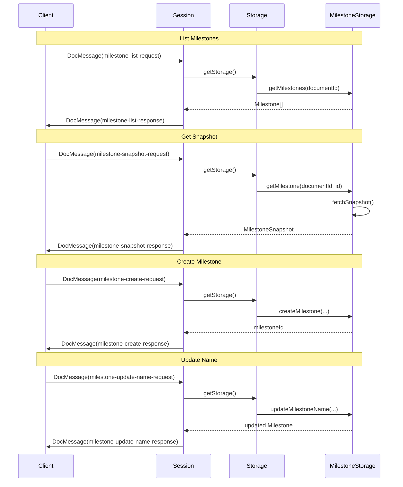

# Milestone Protocol Messages

Add milestone operations to the Teleportal protocol as new `DocMessage` payload types, following the existing pattern of `DocStep` messages.

## Architecture Overview

Milestone operations will be implemented as new `DocStep` types that extend the existing document message protocol. The server will handle these messages in `Session.apply()`, similar to how sync and update messages are processed.




## Implementation Details

### 1. New Message Types

Add to `src/lib/protocol/types.ts`:

- **Request types:**
- `MilestoneListRequest` - Request list of milestones for a document
- `MilestoneSnapshotRequest` - Request a specific milestone snapshot
- `MilestoneCreateRequest` - Request to create a new milestone
- `MilestoneUpdateNameRequest` - Request to update a milestone's name
- **Response types:**
- `MilestoneListResponse` - Response containing array of milestone metadata
- `MilestoneSnapshotResponse` - Response containing the full milestone snapshot
- `MilestoneCreateResponse` - Response containing the created milestone metadata
- `MilestoneUpdateNameResponse` - Response containing the updated milestone metadata
- **Error response:**
- `MilestoneAuthMessage` - Similar to `DecodedAuthMessage`, but for milestone operations

### 2. Protocol Encoding

Update `src/lib/protocol/encode.ts` and `src/lib/protocol/decode.ts`:

- Add new message type codes (0x05-0x0C) for milestone operations in the `doc` message type switch
- Encode/decode request payloads (documentId, milestoneId, name, etc.)
- Encode/decode response payloads (milestone metadata, snapshots)
- Handle binary encoding of `MilestoneSnapshot` as a `Uint8Array` (using `writeVarUint8Array`/`readVarUint8Array`)

### 3. Message Type Updates

Update `src/lib/protocol/message-types.ts`:

- Extend `DocStep` union type to include new milestone step types
- Update `DocMessage` constructor to accept new payload types
- Update `EncodedDocUpdateMessage` type

### 4. Server Handling

Update `src/server/session.ts`:

- Add milestone message handling in `Session.apply()` method's `case "doc"` switch
- For each milestone operation:
- Check permissions using existing `checkPermission` (if provided)
- Access `milestoneStorage` from `DocumentStorage`
- Perform the operation
- Send response back to client
- Handle errors and send `MilestoneAuthMessage` if permission denied

**Note on creating milestones:** When handling `milestone-create-request`, the server needs to:

- Get the current document state from `DocumentStorage.getDocument()`
- Encode the document's current state into a `MilestoneSnapshot` (Uint8Array)
- The exact encoding format is flexible (could be Y.js update, state vector, or custom format)
- Pass the encoded snapshot to `milestoneStorage.createMilestone()`

### 5. Storage Interface Extension

Update `src/storage/types.ts`:

- Add `updateMilestoneName()` method to `MilestoneStorage` interface (if not already present)

### 6. Auto-naming Logic

When creating a milestone without a name:

- Server should auto-generate a name (e.g., "Milestone 1", "Milestone 2", or based on timestamp)
- Implementation should check existing milestone names to avoid conflicts

## Message Flow Details

### List Milestones Request/Response

**Request:**

```typescript
{
  type: "milestone-list-request"
}
```

**Response:**

```typescript
{
  type: "milestone-list-response",
  milestones: Array<{
    id: string,
    name: string,
    documentId: string,
    createdAt: number
  }>
}
```


### Get Snapshot Request/Response

**Request:**

```typescript
{
  type: "milestone-snapshot-request",
  milestoneId: string
}
```

**Response:**

```typescript
{
  type: "milestone-snapshot-response",
  milestoneId: string,
  snapshot: MilestoneSnapshot  // Uint8Array - binary encoded snapshot data (format is flexible)
}
```


### Create Milestone Request/Response

**Request:**

```typescript
{
  type: "milestone-create-request",
  name?: string  // Optional, server auto-generates if not provided
}
```

**Response:**

```typescript
{
  type: "milestone-create-response",
  milestone: {
    id: string,
    name: string,
    documentId: string,
    createdAt: number
  }
}
```


### Update Name Request/Response

**Request:**

```typescript
{
  type: "milestone-update-name-request",
  milestoneId: string,
  name: string
}
```

**Response:**

```typescript
{
  type: "milestone-update-name-response",
  milestone: {
    id: string,
    name: string,
    documentId: string,
    createdAt: number
  }
}
```


## Error Handling

- If `milestoneStorage` is not available: Send `MilestoneAuthMessage` with permission "denied"
- If permission check fails: Send `MilestoneAuthMessage` with permission "denied"
- If milestone not found: Send `MilestoneAuthMessage` with permission "denied" and appropriate reason
- All errors should include a descriptive `reason` field

## Files to Modify

1. `src/lib/protocol/types.ts` - Add new message type definitions
2. `src/lib/protocol/encode.ts` - Add encoding logic for milestone messages
3. `src/lib/protocol/decode.ts` - Add decoding logic for milestone messages
4. `src/lib/protocol/message-types.ts` - Extend DocStep and DocMessage types
5. `src/server/session.ts` - Add milestone message handling
6. `src/storage/types.ts` - Add `updateMilestoneName` method if needed
7. `src/storage/in-memory/milestone-storage.ts` - Implement `updateMilestoneName` if needed
8. `src/storage/unstorage/milestone-storage.ts` - Implement `updateMilestoneName` if needed

## Testing Considerations

- Test encoding/decoding of all milestone message types
- Test server handling with and without milestoneStorage
- Test permission checks