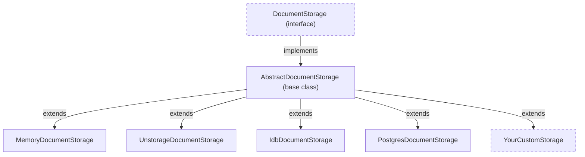

Teleportal decouples storage from compute so you can persist documents to any backend -- Redis, PostgreSQL, S3, SQLite, or a custom API. The storage system is built on two layers of abstraction that let you write a backend without ever touching the Y.js sync protocol.

## Two-Layer Architecture



**`DocumentStorage`** is the low-level interface the server uses for raw protocol messages. It defines methods for sync-step-1/2, handling updates, reading documents, managing metadata, and transactions. The server talks exclusively to this interface -- it never knows which backend is behind it.

**`AbstractDocumentStorage`** is the convenient base class that implements the entire `DocumentStorage` protocol for you. It handles the content-encrypted payload decoding, Y.js update merging, state vector computation, sidecar filtering, attribution storage, deduplication, and metadata bookkeeping. Your backend only implements a small set of persistence primitives.

The abstraction exists because the sync protocol is complex. A raw `DocumentStorage` implementation would need to understand content-encrypted envelopes, V2 update merging, state vector diffing, and sidecar index filtering. `AbstractDocumentStorage` absorbs all of that complexity. Your backend never has to understand the wire protocol -- it just stores and retrieves bytes.

## The DocumentState Model

Every persisted document is represented as a `DocumentState`:

```typescript
type DocumentState = {
  update: Uint8Array; // merged Y.js V2 update (CRDT structure)
  sidecars: IndexedSidecar[]; // encrypted content sidecars
};
```

For **unencrypted documents**, the `update` field contains the full Y.js V2 update with all content, and `sidecars` is an empty array.

For **encrypted documents**, the `update` field contains only the CRDT structure (operation metadata without content), and `sidecars` holds the encrypted content blobs. Each sidecar carries an index (which client IDs and clock ranges it covers) and a hash for deduplication.

The same `AbstractDocumentStorage` class handles both modes -- pass `encrypted: true` or `encrypted: false` to the constructor. The `encrypted` flag tags metadata; the server treats encrypted and plaintext documents identically because it never sees decrypted content.

## What the Base Class Handles for You

When you extend `AbstractDocumentStorage`, the base class takes care of:

- **Decoding the content-encrypted payload** -- incoming updates arrive as an encoded envelope containing a structure update and encrypted sidecars. The base class decodes this before persisting.
- **Merging incoming updates** -- uses a merge-on-read strategy where updates are appended to a pending log on write (O(1)), then batch-merged via `Y.mergeUpdatesV2` when the document is read. This trades storage for CPU: writes are cheap, reads pay the merge cost.
- **Computing state vectors** -- for sync-step-1/2, the base class computes state vectors from the merged update and diffs them against the client's vector to produce minimal sync responses.
- **Filtering relevant sidecars** -- during sync, only sidecars whose client ID / clock ranges overlap the computed diff are sent, avoiding unnecessary data transfer.
- **Writing size and attribution metadata** -- timestamps, size tracking, and optional attribution data are maintained automatically on each update.
- **Deduplication** -- sidecar hashes prevent duplicate encrypted content from accumulating, and sidecar compaction records allow the base class to replace multiple sidecars with a single compacted one.

## What You Implement

When extending `AbstractDocumentStorage`, you implement these abstract persistence primitives:

```typescript
abstract class AbstractDocumentStorage implements DocumentStorage {
  // Pending log (merge-on-read)
  abstract appendUpdate(key: string, entry: PendingUpdate): Promise<void>;
  abstract getPendingUpdates(key: string): Promise<{ updates: PendingUpdate[]; cursor: number }>;
  abstract clearPendingUpdates(key: string, upToCursor: number): Promise<void>;

  // Base (compacted) state
  abstract getBaseState(key: string): Promise<DocumentState | null>;
  abstract replaceBaseState(
    key: string,
    update: Uint8Array,
    sidecars: IndexedSidecar[],
  ): Promise<void>;

  // Metadata
  abstract getDocumentMetadata(key: string): Promise<DocumentMetadata>;
  abstract writeDocumentMetadata(key: string, metadata: DocumentMetadata): Promise<void>;

  // Cleanup
  abstract deleteDocument(key: string): Promise<void>;

  // Optional overrides
  transaction<T>(key: string, cb: () => Promise<T>): Promise<T>; // default: just calls cb()
  storeAttribution(key: string, attribution: EncodedContentMap): Promise<void>; // default: no-op
}
```

The merge-on-read design splits persistence into two concerns:

1. **The pending log** (`appendUpdate`, `getPendingUpdates`, `clearPendingUpdates`) -- an append-only queue of unmerged updates. Writes are O(1) appends.
2. **The base state** (`getBaseState`, `replaceBaseState`) -- the last fully-merged document snapshot. When reading, the base class materializes all pending updates against this snapshot.

This means your backend only needs an append-capable store (for the log) and a key-value store (for the base state). There is no requirement to understand Y.js encoding.

## Transactions

Concurrent writes to the same document must be serialized to prevent lost updates and corrupt merges. The `transaction()` method wraps storage operations in an atomic scope.

The default implementation simply calls the callback with no locking -- this is safe for in-memory or single-process deployments where JavaScript's event loop provides natural serialization. For production backends with concurrent access, you should override `transaction()` with an appropriate strategy:

- **Database transactions** (PostgreSQL, MySQL) -- use your database's native transaction support with row-level locks.
- **Distributed locks with TTL** (Redis, etcd) -- acquire a per-document lock with a timeout. The unstorage implementation uses this approach with a default TTL of 5000ms to prevent deadlocks.
- **Optimistic locking** -- use version numbers or ETags; retry on conflict.
- **Sequential execution** -- for in-memory stores, the single-threaded event loop is sufficient.

The `transaction()` method is optional but important for production backends. Without it, two concurrent `handleUpdate` calls for the same document could read the same base state, merge independently, and overwrite each other's changes.

## VirtualStorage Wrapper

`VirtualStorage` is a configurable decorator that adds write buffering and batching to any `DocumentStorage` implementation. It wraps an existing storage instance and buffers updates in memory, flushing them to the underlying backend in batches.

```typescript
import { VirtualStorage } from "teleportal/storage";

const bufferedStorage = new VirtualStorage(underlyingStorage, {
  batchMaxSize: 100, // flush after 100 buffered updates
  batchWaitMs: 2000, // or after 2 seconds, whichever comes first
});
```

**How it works:**

- **Writes** are buffered in memory and dispatched to a batch processor. The batch flushes when either the size limit or time limit is reached.
- **Reads** flush all pending writes for the requested document before reading from the underlying storage. This ensures read-after-write consistency.
- **Deletes and sync operations** also flush pending writes first.

**When to use it:**

- High-frequency collaborative updates where many small writes would overwhelm the backend.
- Slow storage backends (remote databases, object storage) where reducing round trips matters.
- Write-heavy applications where acknowledgment latency is more important than immediate durability.

**Performance trade-offs:**

- Faster write acknowledgment because updates are buffered rather than immediately persisted.
- Reduced database calls through batching.
- Slight read overhead from flushing pending writes before each read.
- Memory usage proportional to the batch size and number of active documents.
- Buffered writes are lost if the process crashes before a flush.

## Storage Composition

Storage types in Teleportal are fully independent. `DocumentStorage`, `FileStorage`, and `MilestoneStorage` have no coupling -- you can mix backends freely:

- PostgreSQL for documents (strong consistency, transactions)
- S3 for files (cheap, durable blob storage)
- Redis for milestones (fast reads, TTL support)

When sharing the same backing store across multiple storage types, use key prefixes to namespace them and prevent collisions:

```typescript
new UnstorageDocumentStorage(storage, { keyPrefix: "document" });
new UnstorageFileStorage(storage, { keyPrefix: "file" });
new UnstorageMilestoneStorage(storage, { keyPrefix: "milestone" });
```

Each storage instance is constructed independently and passed to its respective handler. The server only receives `DocumentStorage` via its `storage` option; file and milestone storage are wired through RPC handlers.

## Code Reference

The following example shows a minimal in-memory implementation of `AbstractDocumentStorage`. This is a reference for the method signatures and expected behavior -- see the [custom storage how-to guide](/docs/guides/custom-storage/) for a step-by-step walkthrough.

```typescript
import {
  AbstractDocumentStorage,
  type DocumentState,
  type PendingUpdate,
} from "teleportal/storage";
import type { DocumentMetadata } from "teleportal/storage";
import type { IndexedSidecar } from "teleportal/protocol/encryption";

export class MyCustomStorage extends AbstractDocumentStorage {
  private baseStates = new Map<string, DocumentState>();
  private pendingLogs = new Map<string, PendingUpdate[]>();
  private metadata = new Map<string, DocumentMetadata>();

  // -- Pending log (merge-on-read) --

  async appendUpdate(key: string, entry: PendingUpdate): Promise<void> {
    const list = this.pendingLogs.get(key) ?? [];
    list.push(entry);
    this.pendingLogs.set(key, list);
  }

  async getPendingUpdates(key: string): Promise<{ updates: PendingUpdate[]; cursor: number }> {
    const list = this.pendingLogs.get(key) ?? [];
    return { updates: [...list], cursor: list.length };
  }

  async clearPendingUpdates(key: string, upToCursor: number): Promise<void> {
    const list = this.pendingLogs.get(key);
    if (!list) return;
    if (upToCursor >= list.length) {
      this.pendingLogs.delete(key);
    } else {
      list.splice(0, upToCursor);
    }
  }

  // -- Base state --

  async getBaseState(key: string): Promise<DocumentState | null> {
    return this.baseStates.get(key) ?? null;
  }

  async replaceBaseState(
    key: string,
    update: Uint8Array,
    sidecars: IndexedSidecar[],
  ): Promise<void> {
    this.baseStates.set(key, { update, sidecars });
  }

  // -- Metadata --

  async writeDocumentMetadata(key: string, meta: DocumentMetadata): Promise<void> {
    this.metadata.set(key, meta);
  }

  async getDocumentMetadata(key: string): Promise<DocumentMetadata> {
    return (
      this.metadata.get(key) ?? {
        createdAt: Date.now(),
        updatedAt: Date.now(),
        encrypted: this.encrypted,
      }
    );
  }

  // -- Cleanup --

  async deleteDocument(key: string): Promise<void> {
    this.baseStates.delete(key);
    this.pendingLogs.delete(key);
    this.metadata.delete(key);
  }
}
```

Wire it into a server like any other storage:

```typescript
const server = new Server({
  storage: async (ctx) => new MyCustomStorage(ctx.encrypted),
});
```

## Next Steps

- [Custom Storage Guide](/docs/guides/custom-storage/) -- step-by-step how-to for building a custom backend
- [Persistent Storage](/docs/guides/persistent-storage/) -- setting up storage with built-in implementations
- [Server](/docs/core-concepts/server/) -- how the server uses storage during sync
