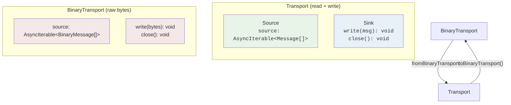
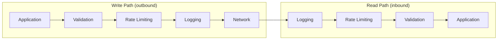

Teleportal's transport layer is designed to be extended. Any communication channel that can send and receive bytes -- WebSockets, WebRTC DataChannels, HTTP long-polling, raw TCP, shared memory -- can be wrapped into a Teleportal transport and immediately gain access to the full middleware stack (encryption, rate limiting, logging, validation, acknowledgments).

This guide explains the design principles behind the transport system, walks through each building block in detail, and shows how to implement a realistic custom transport from scratch.

## Streaming Foundation

Teleportal's transport layer is built on **async iterables** -- the same pull-based streaming primitive that powers `for await...of` loops in JavaScript. This is a deliberate architectural choice over raw callbacks, event emitters, or Node-specific streams. The design delivers five properties that matter for a sync protocol:

**Composability.** Transports compose naturally, like Unix pipes. Each middleware wraps another transport, transforming messages on the way in and out. Encryption, rate limiting, logging, and validation can be stacked in any order without those layers needing to know about each other. You never have to wire up event listeners between layers or manage subscription lifecycles -- each layer is a simple function that takes a transport and returns a transport.

**Backpressure.** When a slow consumer cannot keep up with a fast producer (a client on a degraded network connection receiving a burst of document updates), the async iterable model naturally pauses the producer. The consumer pulls the next batch only when it is ready, preventing unbounded memory growth from buffered messages. This is critical for a sync protocol where update bursts are common during initial document load.

**Runtime portability.** Async iterables are a language-level primitive available in every JavaScript runtime: browsers, Bun, Deno, Node.js, and Cloudflare Workers. By building on a language standard rather than a runtime-specific abstraction, the transport layer works everywhere without polyfills or compatibility shims.

**Cancellation support.** Async iterators support `return()` for clean teardown. When a connection closes, calling `return()` on the iterator propagates cancellation through the entire middleware chain. Combined with `AbortController` integration in sinks, this gives you structured cleanup without dangling listeners.

**Batch-aware processing.** Sources yield arrays of messages (`AsyncIterable<Message[]>`) rather than individual messages. This preserves the natural batching of the underlying transport (a single WebSocket frame might carry multiple protocol messages) and lets middleware process batches efficiently without forcing artificial one-at-a-time overhead.

## Source / Sink / Transport Model

The transport system is built from three primitives:

### Source

A **Source** produces messages. It exposes a single `source` property -- an async iterable that yields batches (arrays) of messages:

```typescript
type Source<Context, AdditionalProperties = {}> = {
  source: AsyncIterable<Message<Context>[]>;
} & AdditionalProperties;
```

You consume a source with a `for await...of` loop. Each iteration yields an array of messages (a batch). The source closes naturally when the underlying connection closes -- the loop simply exits.

### Sink

A **Sink** consumes messages. It exposes a `write` method to send a single message and a `close` method for cleanup:

```typescript
type Sink<Context, AdditionalProperties = {}> = {
  write(message: Message<Context>): void | Promise<void>;
  close(): void;
} & AdditionalProperties;
```

The `write` method can be synchronous or asynchronous. When it returns a `Promise`, the caller can await delivery confirmation from the underlying transport.

### Transport

A **Transport** combines both Source and Sink. It can read and write messages:

```typescript
type Transport<Context, AdditionalProperties = {}> = Source<Context, AdditionalProperties> &
  Sink<Context, AdditionalProperties>;
```

This is a simple intersection type. A transport has a `source` for reading, a `write` method for writing, and a `close` method for cleanup.

### BinaryTransport

A **BinaryTransport** works with raw `Uint8Array` bytes (`BinaryMessage`) instead of decoded `Message` objects:

```typescript
type BinaryTransport<AdditionalProperties = {}> = {
  source: AsyncIterable<BinaryMessage[]>;
  write(message: BinaryMessage): void | Promise<void>;
  close(): void;
} & AdditionalProperties;
```

Binary transports represent what comes directly off the wire before any protocol decoding. They are the starting point for custom transports that deal in raw bytes.

### How They Relate



### AdditionalProperties

Both Source, Sink, and Transport accept a second type parameter, `AdditionalProperties`. This lets transports attach extra properties -- for example, a PubSub transport adds `subscribe()` and `unsubscribe()` methods, and an ACK-tracking sink adds `waitForAcks()`. These properties are preserved through middleware composition via TypeScript's intersection types.

## Middleware Composition

Transports compose as layers, following a pattern sometimes called the "onion model." Each middleware wraps another transport, adding functionality. Messages pass through each layer on the way in (source) and on the way out (sink).

### The Layering Pattern

Every middleware function follows the same signature: it takes a transport (or source/sink) and returns a new transport with the same interface plus the added behavior. This means middleware is stackable in any order:

```typescript
import { withLogger, withMessageValidator } from "teleportal/transports";
import { withRateLimit } from "teleportal/transports/rate-limiter";

// Start with the base transport
let transport = getBaseTransport();

// Layer 1: Validation (closest to the application)
transport = withMessageValidator(transport, {
  isAuthorized: async (message, type) => checkAuth(message),
});

// Layer 2: Rate limiting
transport = withRateLimit(transport, { rules: myRules });

// Layer 3: Logging (closest to the wire)
transport = withLogger(transport);
```

### Message Flow Through Layers

When a message is **written** (outbound), it passes through layers from the application outward to the wire. When a message is **read** (inbound), it passes from the wire inward to the application. Each layer can inspect, transform, filter, or reject messages.



The key insight is that **each middleware is independent**. The rate limiter does not know about the logger. The validator does not know about rate limiting. They are composed by wrapping, not by configuration. This makes each middleware simple to implement, test, and reason about.

### Writing Your Own Middleware

A middleware function wraps a transport's source, sink, or both. Here is a minimal example that counts messages:

```typescript
import type { Transport, Message } from "teleportal";
import { compose, filterMessages, withPassthroughSink } from "teleportal/transports";

function withCounter<
  Context extends Record<string, unknown>,
  Props extends Record<string, unknown>,
>(transport: Transport<Context, Props>): Transport<Context, Props> {
  let readCount = 0;
  let writeCount = 0;

  // Wrap the source to count reads
  const wrappedSource = {
    ...transport,
    source: filterMessages<Message<Context>>((msg) => {
      readCount++;
      console.log(`Read #${readCount}:`, msg.type);
      return true; // pass all messages through
    })(transport.source),
  };

  // Wrap the sink to count writes
  const wrappedSink = withPassthroughSink(transport, {
    onWrite: (msg) => {
      writeCount++;
      console.log(`Write #${writeCount}:`, msg.type);
    },
  });

  return compose(wrappedSource, wrappedSink);
}
```

## Binary vs Message Transport Conversion

Most communication channels deal in raw bytes. WebSocket `onmessage` gives you an `ArrayBuffer`. WebRTC DataChannels produce `Uint8Array`. HTTP responses carry binary payloads. These raw bytes need to be decoded into Teleportal's `Message` objects before the protocol layer can process them.

Two functions handle this conversion:

### `fromBinaryTransport(binaryTransport, context)`

Converts a `BinaryTransport` (raw bytes) into a `Transport` (decoded messages). This is the function you will use most often when building custom transports:

```typescript
import { fromBinaryTransport } from "teleportal/transports";

const messageTransport = fromBinaryTransport(binaryTransport, {
  clientId: "client-123",
  document: "my-doc",
});
```

During conversion, `fromBinaryTransport` handles two things automatically:

1. **Decoding**: Each `BinaryMessage` is decoded into the appropriate `Message` subtype (document update, awareness update, ACK, RPC, etc.).
2. **Ping/pong**: Ping messages from the server are intercepted and answered with a pong automatically. They never surface to the decoded source. This keeps the connection alive without the application needing to handle keepalive logic.

### `toBinaryTransport(transport, context)`

Converts a `Transport` (decoded messages) back into a `BinaryTransport` (raw bytes). This is useful when you need to re-encode messages for transmission:

```typescript
import { toBinaryTransport } from "teleportal/transports";

const binaryTransport = toBinaryTransport(messageTransport, context);
```

### When to Use Each

| Scenario                                                     | Function                                      |
| ------------------------------------------------------------ | --------------------------------------------- |
| Custom transport receives raw bytes from the wire            | `fromBinaryTransport` to get decoded messages |
| You need to forward messages as raw bytes to another channel | `toBinaryTransport` to get encodable bytes    |
| The transport already produces decoded `Message` objects     | Neither -- use the transport directly         |

## Utility Functions

The transport module exports several utility functions for composing and connecting transports.

### `compose(source, sink)`

Combines a separate `Source` and `Sink` into a single `Transport`. This is the primary way to build a transport from its two halves:

```typescript
import { compose } from "teleportal/transports";

const transport = compose(mySource, mySink);
// transport.source  -- from mySource
// transport.write() -- from mySink
// transport.close() -- from mySink
```

Any additional properties from both the source and sink are preserved on the resulting transport via TypeScript intersection types.

### `connect(source, sink)`

Pipes messages from a Source into a Sink. This is a one-way flow -- every message yielded by the source is written to the sink. The returned promise resolves when the source closes:

```typescript
import { connect } from "teleportal/transports";

// All messages from source are written to sink
await connect(mySource, mySink);
```

`connect` also accepts a bare `AsyncIterable<Message[]>` as the source argument, not just a `Source` object.

### `sync(transportA, transportB)`

Bidirectional sync -- messages from A go to B, and messages from B go to A. This is equivalent to calling `connect` in both directions simultaneously:

```typescript
import { sync } from "teleportal/transports";

// Messages flow both ways
await sync(transportA, transportB);
```

The returned promise resolves when both directions have completed (both sources have closed).

### `createFanOutWriter()`

Creates a broadcast writer where one producer sends messages to many consumers. Each call to `getReader()` creates an independent consumer that receives all messages sent after it subscribes:

```typescript
import { createFanOutWriter } from "teleportal/transports";

const fanOut = createFanOutWriter<Message>();

// Create readers for each client
const reader1 = fanOut.getReader();
const reader2 = fanOut.getReader();

// Send once -- both readers receive it
fanOut.send(message);

// Each reader has an async iterable source
for await (const batch of reader1.source) {
  // process batch
}

// Unsubscribe a reader when its client disconnects
reader2.unsubscribe();

// Close the writer when done
fanOut.close();
```

This is the core primitive behind server-side message broadcasting to multiple connected clients.

### `forEachMessage(source, fn)`

Drains a batched source one item at a time, calling `fn` for each message. A convenience for when you want to process messages individually rather than in batches:

```typescript
import { forEachMessage } from "teleportal/transports";

await forEachMessage(mySource, async (message) => {
  console.log("Received:", message.type, message.document);
});
```

### Transform Helpers

Three higher-order functions create transforms over batched async iterables. These are the building blocks for writing middleware that transforms the source side of a transport:

- **`mapMessages(fn)`** -- Map each message to a new value, or drop it by returning `null`/`undefined`.
- **`filterMessages(predicate)`** -- Keep only messages that pass the predicate.
- **`flatMapMessages(fn)`** -- Expand each message into zero or more output messages.

```typescript
import { mapMessages, filterMessages } from "teleportal/transports";

// Drop awareness messages from a source
const filteredSource = filterMessages<Message<MyContext>>((msg) => msg.type !== "awareness")(
  transport.source,
);

// Transform messages
const mappedSource = mapMessages((msg: Message<MyContext>) => {
  // Return null to drop, or a transformed message to keep
  return msg.type === "doc" ? msg : null;
})(transport.source);
```

## Custom Transport Example: WebRTC DataChannel

Here is a realistic example of wrapping a WebRTC DataChannel as a Teleportal transport. The DataChannel sends and receives raw bytes, so we build a `BinaryTransport` first and then convert it to a `Transport` with `fromBinaryTransport`.

```typescript
import {
  createChannel,
  compose,
  fromBinaryTransport,
  withLogger,
  withMessageValidator,
} from "teleportal/transports";
import type { BinaryTransport, BinaryMessage, Message } from "teleportal";

type MyContext = { clientId: string; document: string };

function createDataChannelTransport(dataChannel: RTCDataChannel, context: MyContext) {
  // -- Step 1: Build a BinaryTransport from the DataChannel --

  // Source: read raw bytes from the DataChannel
  const channel = createChannel<BinaryMessage>();

  dataChannel.binaryType = "arraybuffer";
  dataChannel.onmessage = (event) => {
    channel.send(new Uint8Array(event.data));
  };
  dataChannel.onclose = () => {
    channel.close();
  };
  dataChannel.onerror = (err) => {
    channel.error(err);
  };

  // Sink: write raw bytes to the DataChannel
  const binaryTransport: BinaryTransport = {
    source: channel,
    write(message: BinaryMessage) {
      if (dataChannel.readyState === "open") {
        dataChannel.send(message);
      }
    },
    close() {
      dataChannel.close();
      channel.close();
    },
  };

  // -- Step 2: Convert from binary to message transport --
  // This handles protocol decoding and automatic ping/pong
  let transport = fromBinaryTransport(binaryTransport, context);

  // -- Step 3: Layer on middleware --
  transport = withMessageValidator(transport, {
    isAuthorized: async (message, type) => {
      // Only allow messages for the expected document
      return message.document === context.document;
    },
  });

  transport = withLogger(transport);

  return transport;
}
```

The key steps are:

1. **Build a BinaryTransport** by creating a `Channel` (async iterable) for the source side and implementing `write`/`close` for the sink side.
2. **Convert to a message transport** with `fromBinaryTransport`, which handles decoding and ping/pong.
3. **Layer middleware** using the standard `with*` functions.

The same pattern applies to any byte-oriented channel: a custom TCP connection, a shared memory buffer, a Unix domain socket, or a postMessage bridge between workers.

## Available Middleware

Teleportal ships with several built-in middleware transports. Each follows the same wrapping pattern and can be composed in any order.

### `withLogger`

Logs all messages read from and written to the transport to the console. Useful for debugging during development:

```typescript
import { withLogger } from "teleportal/transports";

const logged = withLogger(transport);
```

### `withRateLimit`

Enforces rate limiting using a token bucket algorithm. Supports per-user, per-document, per-user-document, or per-transport tracking. Messages that exceed the rate limit are silently dropped:

```typescript
import { withRateLimit } from "teleportal/transports/rate-limiter";

const limited = withRateLimit(transport, {
  rules: [
    {
      id: "per-user",
      maxMessages: 300,
      windowMs: 1000,
      trackBy: "user",
    },
  ],
  onRateLimitExceeded: (details) => {
    console.warn("Rate limited:", details.ruleId, details.userId);
  },
});
```

### `withMessageValidator`

Adds authorization checks to messages on read, write, or both. Unauthorized messages are silently filtered out:

```typescript
import { withMessageValidator } from "teleportal/transports";

const validated = withMessageValidator(transport, {
  isAuthorized: async (message, type) => {
    // type is "read" or "write"
    return await checkPermissions(message.context.userId, message.document);
  },
});
```

Separate `withMessageValidatorSource` and `withMessageValidatorSink` functions are available when you only need to validate one direction.

### `withPassthrough`

A general-purpose interceptor for inspecting or filtering messages without modifying them. Return `false` from a callback to drop the message:

```typescript
import { withPassthrough } from "teleportal/transports";

const inspected = withPassthrough(transport, {
  onRead: (message) => {
    metrics.increment("messages.read");
    // return false to drop, void/true to pass through
  },
  onWrite: (message) => {
    metrics.increment("messages.write");
  },
});
```

Separate `withPassthroughSource` and `withPassthroughSink` functions are available for one-sided interception.

### `withAckSink` / `withAckTrackingSink`

Add reliable delivery semantics through acknowledgment messages. `withAckSink` is used on the server side to automatically send ACK messages after processing. `withAckTrackingSink` is used on the client side to track sent messages and wait until all are acknowledged:

```typescript
import { withAckSink, withAckTrackingSink } from "teleportal/transports";

// Server: auto-send ACKs after writing
const serverSink = withAckSink(sink, {
  pubSub,
  ackTopic: "acks",
  sourceId: "server-1",
  context: serverContext,
});

// Client: track messages and wait for ACKs
const clientSink = withAckTrackingSink(sink, {
  pubSub,
  ackTopic: "acks",
  sourceId: "client-1",
  ackTimeout: 10000,
});

// Write a message and wait for all ACKs
clientSink.write(message);
await clientSink.waitForAcks();

// Clean up when done
await clientSink.unsubscribe();
```

## Next Steps

- [Transport](/docs/core-concepts/transport/) -- Core concepts overview of the transport system
- [Server](/docs/core-concepts/server/) -- How the server uses transports to handle connections
- [Performance](/docs/advanced/performance/) -- Optimizing transport and middleware performance
