This document provides a comprehensive specification of the Teleportal protocol, a binary messaging protocol built on top of Y.js for real-time collaborative document synchronization and awareness updates. It describes how all the pieces fit together to enable efficient, type-safe communication for collaborative editing applications.

## Protocol Overview

The Teleportal protocol is designed for efficient transmission of Y.js collaborative editing messages over various transport layers. It supports document synchronization, awareness updates, file transfers, milestone management, and extensible RPC operations—all with optional encryption and robust error handling.

The protocol is built around a flexible message structure that enables:
- **Document Synchronization**: Bidirectional sync of Y.js documents between clients and server
- **Awareness Updates**: Real-time user presence and cursor information
- **File Transfers**: Chunked file uploads/downloads with Merkle tree integrity verification
- **Milestone Management**: Snapshot-based versioning and document history
- **RPC Operations**: Extensible custom operations for application-specific needs
- **Message Acknowledgment**: Delivery confirmation for reliable message handling

## Message Format

### Base Message Structure

All Teleportal messages follow this base structure:

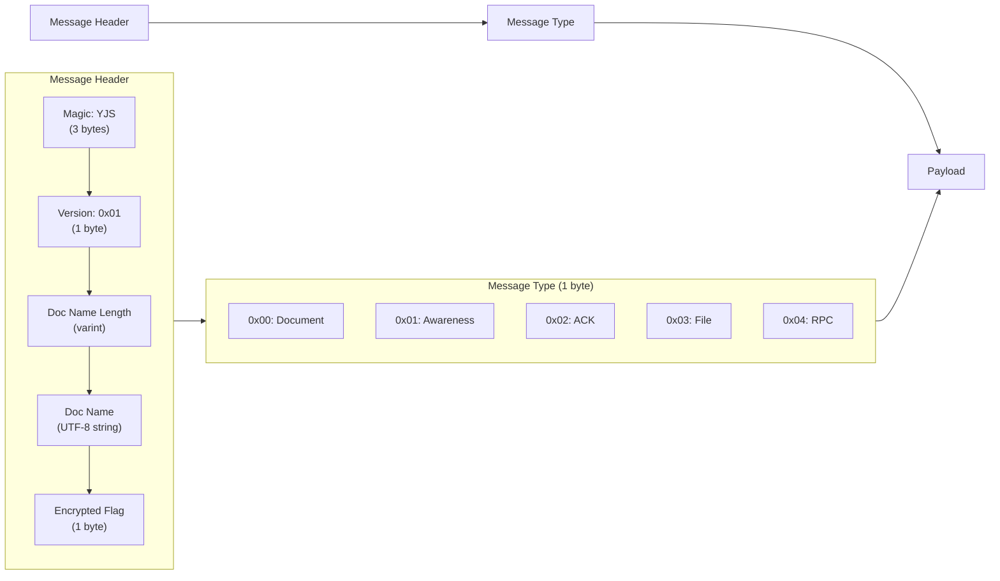

```
┌─────────────────────────────────────────────────────────────────────────────────┐
│                            Teleportal Message Header                            │
├─────────────┬─────────────┬─────────────┬─────────────┬─────────────────────────┤
│ Magic Number│   Version   │ Doc Name Len│ Doc Name    │      Encrypted Flag     │
│   (3 bytes) │  (1 byte)   │  (varint)   │  (string)   │       (1 byte)          │
├─────────────┼─────────────┼─────────────┼─────────────┼─────────────────────────┤
│ 0x59|0x4A|  │    0x01     │   length    │   UTF-8     │    0x00=false           │
│     0x53    │             │             │   string    │    0x01=true            │
│    "YJS"    │             │             │             │                         │
└─────────────┴─────────────┴─────────────┴─────────────┴─────────────────────────┘
```

**Note**: For file messages, the document name may be an empty string. ACK messages do not have a document name (it is `undefined`).

### Message Type Hierarchy

The protocol organizes messages into categories, each with specific subtypes:

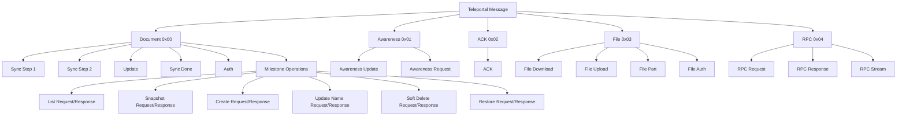

## Document Messages (Type 0x00)

Document messages handle Y.js document synchronization, updates, and milestone management. They form the core of the collaborative editing system.

### Document Message Structure

```
┌───────────────────────────────────────────────────────────────────────────────┐
│                        Document Message Format                                │
├─────────────┬─────────────────────────────────────────────────────────────────┤
│ Msg Type    │                    Payload                                      │
│ (1 byte)    │                  (variable)                                     │
├─────────────┼─────────────────────────────────────────────────────────────────┤
│ 0x00 = Sync │ State Vector (varint array)                                     │
│ Step 1      │                                                                 │
├─────────────┼─────────────────────────────────────────────────────────────────┤
│ 0x01 = Sync │ Y.js Update (varint array)                                      │
│ Step 2      │                                                                 │
├─────────────┼─────────────────────────────────────────────────────────────────┤
│ 0x02 = Doc  │ Y.js Update (varint array)                                      │
│ Update      │                                                                 │
├─────────────┼─────────────────────────────────────────────────────────────────┤
│ 0x03 = Sync │ (no payload)                                                    │
│ Done        │                                                                 │
├─────────────┼─────────────────────────────────────────────────────────────────┤
│ 0x04 = Auth │ Permission (1 byte) + Reason (varint string)                    │
│ Message     │ 0x00=denied, 0x01=allowed                                       │
├─────────────┼─────────────────────────────────────────────────────────────────┤
│ 0x05 = Mile │ SnapshotIds count (varint) + SnapshotIds array (varint strings) │
│ List Req    │                                                                 │
├─────────────┼─────────────────────────────────────────────────────────────────┤
│ 0x06 = Mile │ Count (varint) + [Id + Name + DocId + CreatedAt + DeletedAt? + │
│ List Resp   │ LifecycleState? + ExpiresAt? + CreatedBy] * N                   │
├─────────────┼─────────────────────────────────────────────────────────────────┤
│ 0x07 = Mile │ MilestoneId (varint string)                                     │
│ Snapshot Req│                                                                 │
├─────────────┼─────────────────────────────────────────────────────────────────┤
│ 0x08 = Mile │ MilestoneId (varint string) + Snapshot (varint array)           │
│ Snapshot Res│                                                                 │
├─────────────┼─────────────────────────────────────────────────────────────────┤
│ 0x09 = Mile │ HasName (1 byte) + Name (varint string, optional) +             │
│ Create Req  │ Snapshot (varint array)                                         │
├─────────────┼─────────────────────────────────────────────────────────────────┤
│ 0x0A = Mile │ Id + Name + DocId + CreatedAt + CreatedBy (Type + Id)          │
│ Create Resp │                                                                 │
├─────────────┼─────────────────────────────────────────────────────────────────┤
│ 0x0B = Mile │ MilestoneId (varint string) + Name (varint string)              │
│ Update Name │                                                                 │
├─────────────┼─────────────────────────────────────────────────────────────────┤
│ 0x0C = Mile │ Id + Name + DocId + CreatedAt + CreatedBy (Type + Id)           │
│ Update Resp │                                                                 │
├─────────────┼─────────────────────────────────────────────────────────────────┤
│ 0x0D = Mile │ Permission (1 byte) + Reason (varint string)                    │
│ Auth Msg    │ 0x00=denied, 0x01=allowed                                       │
├─────────────┼─────────────────────────────────────────────────────────────────┤
│ 0x0E = Mile │ MilestoneId (varint string)                                     │
│ SoftDel Req │                                                                 │
├─────────────┼─────────────────────────────────────────────────────────────────┤
│ 0x0F = Mile │ MilestoneId (varint string)                                     │
│ SoftDel Resp│                                                                 │
├─────────────┼─────────────────────────────────────────────────────────────────┤
│ 0x10 = Mile │ MilestoneId (varint string)                                     │
│ Restore Req │                                                                 │
├─────────────┼─────────────────────────────────────────────────────────────────┤
│ 0x11 = Mile │ MilestoneId (varint string)                                     │
│ Restore Resp│                                                                 │
└─────────────┴─────────────────────────────────────────────────────────────────┘
```

### Document Synchronization Messages

The document synchronization process uses a bidirectional sync protocol to ensure all clients have consistent document state:

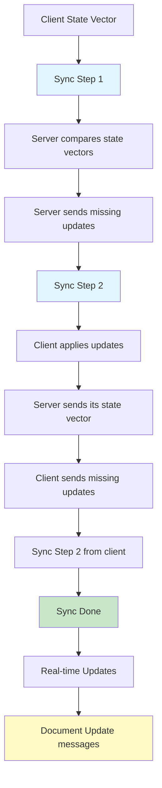

#### Sync Step 1 (0x00)

**Purpose**: Initiates synchronization by sending local state vector  
**Payload**: Y.js state vector as variable-length byte array  
**Usage**: Client sends this to request updates from server. The state vector represents what the client knows about the document's current state.

#### Sync Step 2 (0x01)

**Purpose**: Responds to Sync Step 1 with missing updates  
**Payload**: Y.js update containing missing operations  
**Usage**: Server responds with updates not present in client's state. This enables efficient synchronization by only sending what's needed.

#### Document Update (0x02)

**Purpose**: Sends incremental document changes  
**Payload**: Y.js update containing new operations  
**Usage**: Real-time propagation of document changes after initial sync is complete.

#### Sync Done (0x03)

**Purpose**: Indicates synchronization completion  
**Payload**: None  
**Usage**: Signals that both sync steps have been completed and the client is now in sync with the server.

#### Auth Message (0x04)

**Purpose**: Handles authentication and authorization  
**Payload**: Permission flag (1 byte) + reason string (variable length)  
**Usage**: Server sends to grant/deny access with explanation. Used when a client attempts to access a document they don't have permission for.

### Milestone Management Messages

Milestones provide snapshot-based versioning for documents, allowing users to save and restore specific document states.

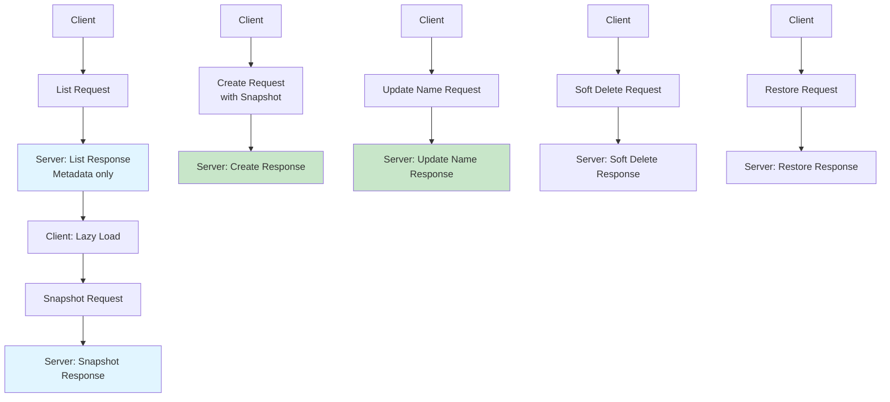

#### Milestone List Request (0x05)

**Purpose**: Requests a list of all milestones for a document  
**Payload**: SnapshotIds count (varint) + SnapshotIds array (varint strings)  
**Usage**: Client requests milestone metadata (without snapshot content). The client can provide a list of snapshot IDs so the server can send only milestones that are not already known, enabling efficient incremental updates.

#### Milestone List Response (0x06)

**Purpose**: Returns list of milestone metadata  
**Payload**: Count (varint) + array of milestone metadata  
**Usage**: Server responds with milestone list. Each milestone includes:
- Required fields: id, name, documentId, createdAt, createdBy
- Optional fields: deletedAt, lifecycleState, expiresAt
- `createdBy`: Indicates who/what created the milestone (`{ type: "user" | "system", id: string }`)

#### Milestone Snapshot Request (0x07)

**Purpose**: Requests the snapshot content for a specific milestone  
**Payload**: MilestoneId (varint string)  
**Usage**: Client requests full snapshot data to fulfill lazy loading. This enables efficient initial loading by fetching metadata first, then snapshots on demand.

#### Milestone Snapshot Response (0x08)

**Purpose**: Returns the snapshot content for a milestone  
**Payload**: MilestoneId (varint string) + Snapshot (varint array - binary encoded)  
**Usage**: Server responds with milestone snapshot data, which is a Y.js document snapshot that can be applied to restore the document state.

#### Milestone Create Request (0x09)

**Purpose**: Requests creation of a new milestone from current document state  
**Payload**: HasName (1 byte) + Name (varint string, optional) + Snapshot (varint array)  
**Usage**: Client requests milestone creation with the document snapshot; server auto-generates name if not provided.

#### Milestone Create Response (0x0A)

**Purpose**: Confirms milestone creation and returns metadata  
**Payload**: Milestone metadata (id, name, documentId, createdAt, createdBy)  
**Usage**: Server responds with created milestone information. The `createdBy` field indicates who created the milestone:
- `{ type: "user", id: userId }` for user-created milestones
- `{ type: "system", id: nodeId }` for system-created milestones

#### Milestone Update Name Request (0x0B)

**Purpose**: Requests updating a milestone's name  
**Payload**: MilestoneId (varint string) + Name (varint string)  
**Usage**: Client requests name change for an existing milestone.

#### Milestone Update Name Response (0x0C)

**Purpose**: Confirms milestone name update  
**Payload**: Milestone metadata (id, name, documentId, createdAt, createdBy)  
**Usage**: Server responds with updated milestone information. When a user renames a milestone, the `createdBy` field is updated to mark it as user-created (`{ type: "user", id: userId }`).

#### Milestone Auth Message (0x0D)

**Purpose**: Error response for milestone operations  
**Payload**: Permission flag (1 byte) + reason string (variable length)  
**Usage**: Server sends when milestone operation fails (not found, permission denied, etc.).

#### Milestone Soft Delete Request (0x0E)

**Purpose**: Requests soft deletion of a milestone  
**Payload**: MilestoneId (varint string)  
**Usage**: Client requests soft deletion of a milestone, which marks it as deleted but preserves the data.

#### Milestone Soft Delete Response (0x0F)

**Purpose**: Confirms soft deletion of a milestone  
**Payload**: MilestoneId (varint string)  
**Usage**: Server responds with ID of the soft deleted milestone.

#### Milestone Restore Request (0x10)

**Purpose**: Requests restoration of a soft-deleted milestone  
**Payload**: MilestoneId (varint string)  
**Usage**: Client requests restoration of a deleted milestone.

#### Milestone Restore Response (0x11)

**Purpose**: Confirms restoration of a milestone  
**Payload**: MilestoneId (varint string)  
**Usage**: Server responds with ID of the restored milestone.

## ACK Messages (Type 0x02)

ACK messages provide message delivery confirmation, allowing senders to know when their messages have been successfully received and processed.

### ACK Message Structure

```
┌─────────────────────────────────────────────────────────────────────────────────┐
│                            ACK Message Format                                   │
├─────────────┬───────────────────────────────────────────────────────────────────┤
│ Msg Type    │                    Payload                                        │
│ (1 byte)    │                  (variable)                                       │
├─────────────┼───────────────────────────────────────────────────────────────────┤
│ 0x02 = ACK  │ MessageId (varint array) - Base64-decoded message ID              │
└─────────────┴───────────────────────────────────────────────────────────────────┘
```

**Purpose**: Acknowledges receipt of a specific message  
**Payload**: MessageId (varint array) - The base64-decoded message ID of the message being acknowledged  
**Usage**:
- Used to confirm delivery of file chunks during uploads
- Allows senders to track which messages have been successfully received
- The messageId is the SHA-256 hash (base64-encoded) of the original message's encoded bytes

**Note**: ACK messages do not have a document name and are not tied to a specific document context.

## Awareness Messages (Type 0x01)

Awareness messages handle user presence and cursor information in collaborative sessions, enabling real-time collaboration features like showing where other users are editing.

### Awareness Message Structure

```
┌─────────────────────────────────────────────────────────────────────────────────┐
│                       Awareness Message Format                                  │
├─────────────┬───────────────────────────────────────────────────────────────────┤
│ Msg Type    │                    Payload                                        │
│ (1 byte)    │                  (variable)                                       │
├─────────────┼───────────────────────────────────────────────────────────────────┤
│ 0x00 = Aware│ Y.js Awareness Update (varint array)                              │
│ Update      │                                                                   │
├─────────────┼───────────────────────────────────────────────────────────────────┤
│ 0x01 = Aware│ (no payload)                                                      │
│ Request     │                                                                   │
└─────────────┴───────────────────────────────────────────────────────────────────┘
```

### Awareness Message Types

#### Awareness Update (0x00)

**Purpose**: Sends user presence and cursor information  
**Payload**: Y.js awareness update as variable-length byte array  
**Usage**: Propagates user activity, cursor position, selection state, and other presence information to all connected clients.

#### Awareness Request (0x01)

**Purpose**: Requests current awareness state  
**Payload**: None  
**Usage**: Client requests current user presence information when joining a document or when awareness state is needed.

## File Messages (Type 0x03)

File messages handle file uploads and downloads with chunking and Merkle tree verification for integrity. Files are transferred in chunks with cryptographic proofs to ensure data integrity.

### File Message Structure

```
┌───────────────────────────────────────────────────────────────────────────────────┐
│                            File Message Format                                    │
├─────────────┬─────────────────────────────────────────────────────────────────────┤
│ Msg Type    │                    Payload                                          │
│ (1 byte)    │                  (variable)                                         │
├─────────────┼─────────────────────────────────────────────────────────────────────┤
│ 0x00 = File │ FileId (varint string)                                              │
│ Download    │                                                                     │
├─────────────┼─────────────────────────────────────────────────────────────────────┤
│ 0x01 = File │ Encrypted (1 byte) + FileId (varint string) + Filename (string)     │
│ Upload      │ + Size (varint) + MimeType (string) + LastModified (varint)         │
├─────────────┼─────────────────────────────────────────────────────────────────────┤
│ 0x02 = File │ FileId (varint string) + ChunkIndex (varint) + ChunkData            │
│ Part        │ (varint array) + MerkleProofLength (varint) + MerkleProof (array) + │
│             │ TotalChunks (varint) + BytesUploaded (varint) + Encrypted (1 byte)  │
├─────────────┼─────────────────────────────────────────────────────────────────────┤
│ 0x03 = File │ Permission (1 byte) + FileId (varint string) + StatusCode           │
│ Auth        │ (varint) + HasReason (1 byte) + Reason (varint string, optional)    │
│ Message     │                                                                     │
└─────────────┴─────────────────────────────────────────────────────────────────────┘
```

### File Message Types

#### File Download (0x00)

**Purpose**: Initiates file download by requesting a file using its content ID

**Payload Structure**:
- FileId (varint string): Merkle root hash (base64 string) identifying the file to download

**Usage**: Client requests file by providing the merkle root hash as the fileId. The server responds with file-part messages containing the file chunks.

#### File Upload (0x01)

**Purpose**: Initiates file upload by sending file metadata

**Payload Structure**:
- Encrypted (1 byte): `0x00` = false, `0x01` = true
- FileId (varint string): Client-generated UUID for this transfer session
- Filename (varint string): Original filename
- Size (varint): File size in bytes (includes encryption overhead if encrypted)
- MimeType (varint string): MIME type of the file
- LastModified (varint): Last modified timestamp of the file

**Usage**:
- Client sends file metadata with a client-generated UUID as `fileId` to initiate upload session
- During upload, chunks are sent with this same `fileId` (UUID) to identify the transfer session
- After all chunks are uploaded and verified, the server computes the Merkle root hash
- The client receives this Merkle root hash (base64-encoded) as the final `fileId`, which should be used for future downloads
- **Note**: The `fileId` changes from the temporary UUID to the permanent Merkle root hash after upload completion

#### File ID Lifecycle

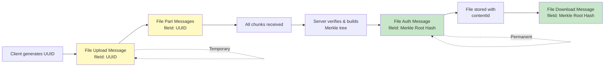

#### File Part (0x02)

**Purpose**: Sends file chunk data with Merkle proof for verification

**Payload Structure**:
- FileId (varint string):
  - **Upload**: Client-generated UUID matching the file upload session
  - **Download**: Merkle root hash (base64 string) identifying the file
- ChunkIndex (varint): Zero-based index of this chunk
- ChunkData (varint array): Chunk data (typically 64KB, or smaller for encrypted chunks)
- MerkleProofLength (varint): Number of proof hashes in the Merkle proof path
- MerkleProof (array of varint arrays): Merkle proof path hashes (sibling hashes from leaf to root)
- TotalChunks (varint): Total number of chunks in the file
- BytesUploaded (varint): Cumulative bytes uploaded/downloaded so far
- Encrypted (1 byte): `0x00` = false, `0x01` = true

**Usage**:
- **Upload**: Client sends chunks sequentially with Merkle proofs for server verification. Each chunk is acknowledged with an ACK message containing the chunk's message ID.
- **Download**: Server sends chunks sequentially with Merkle proofs for client verification. The client verifies each chunk before assembling the complete file.

**Chunk Verification**: The receiver verifies each chunk by:
1. Computing the SHA-256 hash of the chunk data
2. Reconstructing the Merkle tree path using the provided proof hashes
3. Comparing the computed root hash with the expected fileId
4. Rejecting the chunk if verification fails

#### File Auth Message (0x03)

**Purpose**: Server response indicating permission denied or authorization status

**Payload Structure**:
- Permission (1 byte): `0x00` = denied, `0x01` = allowed (currently only denied is supported)
- FileId (varint string): The fileId of the file that was denied authorization
- StatusCode (varint): HTTP status code (404, 403, 401, 500, or 501)
- HasReason (1 byte): `0x00` = no reason, `0x01` = reason follows
- Reason (varint string, optional): Explanation for denial (only present if HasReason is 1)

**Usage**: Server sends when file request is rejected (e.g., size limit exceeded, unauthorized, file not found)

### File Chunking and Merkle Trees

Files are split into **64KB chunks** for efficient transfer. Each chunk is hashed using SHA-256, and a Merkle tree is constructed to verify file integrity.

#### Merkle Tree Structure

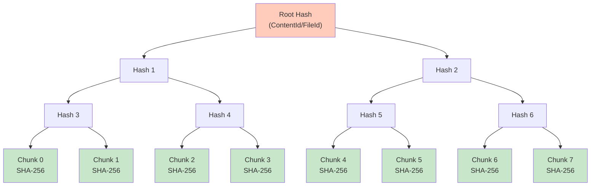

**Structure Components**:
- **Leaf nodes**: SHA-256 hash of each 64KB chunk
- **Internal nodes**: Hash of concatenated child hashes
- **Root hash**: Content ID used to uniquely identify the file
- **Merkle proof**: Path from chunk hash to root (sibling hashes at each level)

#### Merkle Proof Example

When sending Chunk 2, the client includes a Merkle proof that allows the server to verify the chunk:

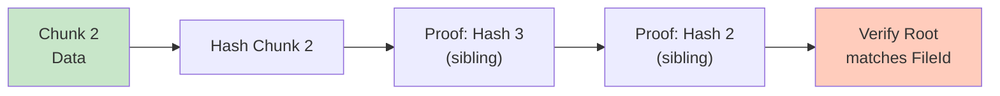

#### Chunk Verification

The verification process ensures data integrity by reconstructing the Merkle tree path:

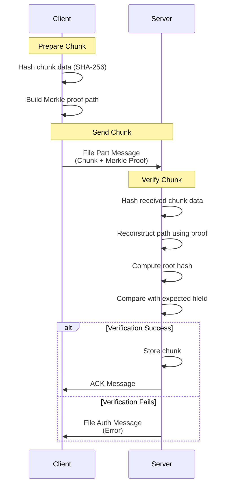

**Verification Steps**:
1. **Client sends**: Chunk data (64KB) + Merkle proof (sibling hashes) + Chunk index
2. **Server receives**: Hashes the chunk data to get leaf hash
3. **Server reconstructs**: Uses proof hashes to build path from leaf to root
4. **Server verifies**: Compares computed root hash with expected fileId
5. **Server responds**: ACK on success, File Auth Message (error) on failure

## RPC Messages (Type 0x04)

RPC messages provide extensible custom operations for application-specific needs. They enable the protocol to be extended without modifying the core message types.

### RPC Message Types

#### RPC Request (0x00)

**Purpose**: Client requests a custom operation  
**Payload**: Method name + Request data  
**Usage**: Enables custom operations beyond the standard protocol messages.

#### RPC Response (0x01)

**Purpose**: Server responds to RPC request  
**Payload**: Request ID + Response data (success or error)  
**Usage**: Returns the result of an RPC operation.

#### RPC Stream (0x02)

**Purpose**: Streaming data for RPC operations  
**Payload**: Request ID + Stream data  
**Usage**: Enables streaming responses for operations that produce large amounts of data incrementally.

## Special Message Types

### Ping/Pong Messages

Keep-alive messages for connection health monitoring:

```
┌───────────────────────────────────────────────────────────────────────────────┐
│                          Ping Message                                         │
├─────────────┬─────────────┬─────────────┬─────────────┬───────────────────────┤
│ Magic Number│      "ping" ASCII bytes                                         │
│   (3 bytes) │           (4 bytes)                                             │
├─────────────┼─────────────┼─────────────┼─────────────┼───────────────────────┤
│ 0x59|0x4A|  │ 0x70|0x69|  │                                                   │
│     0x53    │ 0x6E|0x67   │                                                   │
│    "YJS"    │   "ping"    │                                                   │
└─────────────┴─────────────┴─────────────┴─────────────┴───────────────────────┘
```

```
┌───────────────────────────────────────────────────────────────────────────────┐
│                          Pong Message                                         │
├─────────────┬─────────────┬─────────────┬─────────────┬───────────────────────┤
│ Magic Number│      "pong" ASCII bytes                                         │
│   (3 bytes) │           (4 bytes)                                             │
├─────────────┼─────────────┼─────────────┼─────────────┼───────────────────────┤
│ 0x59|0x4A|  │ 0x70|0x6F|  │                                                   │
│     0x53    │ 0x6E|0x67   │                                                   │
│    "YJS"    │   "pong"    │                                                   │
└─────────────┴─────────────┴─────────────┴─────────────┴───────────────────────┘
```

### Message Arrays

Multiple messages can be batched into a single transmission for efficiency. Messages are concatenated sequentially without an explicit count field:

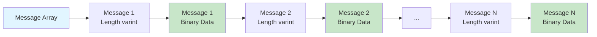

```
┌───────────────────────────────────────────────────────────────────────────────┐
│                        Message Array Format                                   │
├───────────────────────────────────────────────────────────────────────────────┤
│ Message 1 Length (varint) + Message 1 Data (BinaryMessage) +                  │
│ Message 2 Length (varint) + Message 2 Data (BinaryMessage) +                  │
│ ... (repeated for all messages until end of buffer)                           │
└───────────────────────────────────────────────────────────────────────────────┘
```

**Encoding**: Each message in the array is encoded as a varint-prefixed byte array. The decoder reads messages sequentially until the buffer is exhausted.

**Usage**: Useful for reducing network overhead when sending multiple related messages (e.g., multiple document updates or file chunks).

## Encoding Details

### Message Encoding Flow

The encoding process transforms structured message data into binary format:

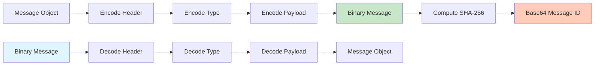

### Message IDs

Every message has a unique identifier computed from its encoded bytes:

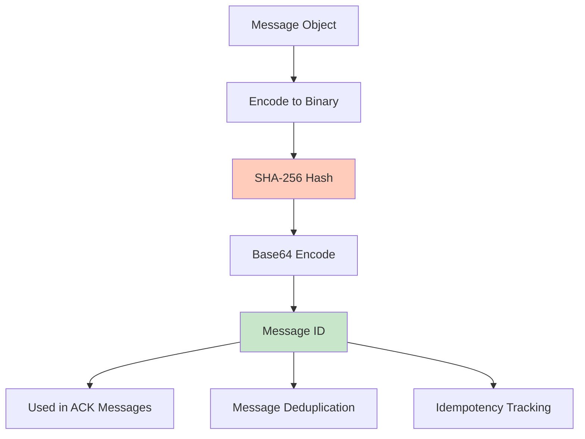

- **Computation**: SHA-256 hash of the message's encoded binary representation
- **Encoding**: Base64-encoded for use in ACK messages and other contexts
- **Purpose**: Enables message deduplication, acknowledgment tracking, and idempotency
- **Lazy Computation**: Message IDs are computed on-demand and cached for performance

### Variable-Length Encoding

The protocol uses variable-length encoding for efficiency:

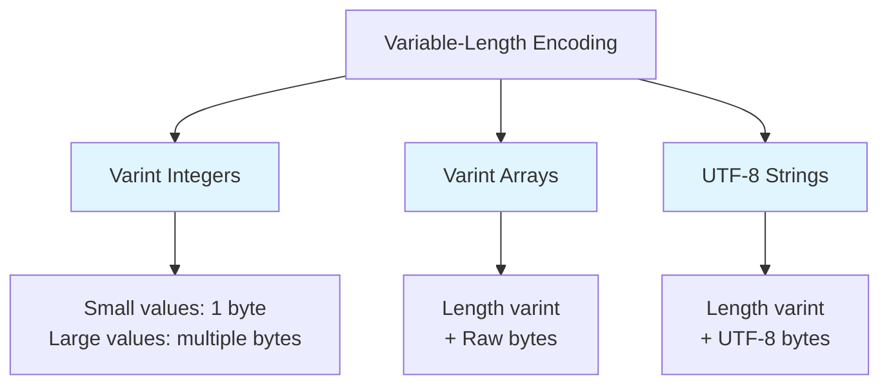

#### Variable-Length Integers (varint)

- Used for lengths and counts
- Follows lib0 encoding standard
- Efficient for small values, expandable for large ones

#### Variable-Length Byte Arrays (varint array)

- Length-prefixed byte arrays
- Length encoded as varint, followed by raw bytes
- Used for Y.js updates, state vectors, and string data

#### String Encoding

- UTF-8 encoded strings
- Length-prefixed with varint length
- Used for document names and reason strings

## Message Flow Examples

### Document Synchronization Flow

```
Client                           Server
  │                                │
  │─────── Sync Step 1 ──────────▶│  (with state vector)
  │                                │
  │◀────── Sync Step 2 ───────────│  (with missing updates)
  │                                │
  │─────── Sync Done ────────────▶│
  │                                │
  │◀────── Sync Done ─────────────│
  │                                │
  │─────── Doc Update ───────────▶│  (real-time changes)
  │                                │
  │◀────── Doc Update ────────────│  (propagated to other clients)
```

### Awareness Flow

```
Client                           Server
  │                                │
  │◀───── Awareness Request ──────│  (request current user states)
  │                                │
  │─────── Awareness Update ─────▶│  (user cursor/selection)
  │                                │
  │◀────── Awareness Update ──────│  (other clients' user states)
```

### File Upload Flow

```
Client                           Server
  │                                │
  │─────── File Upload ──────────▶│  (metadata: uploadId, filename, size, etc.)
  │                                │
  │                                │  (creates upload session)
  │                                │
  │─────── File Part ────────────▶│  (chunk 0 + merkle proof)
  │                                │
  │                                │  (verifies chunk, stores)
  │                                │
  │─────── File Part ────────────▶│  (chunk 1 + merkle proof)
  │                                │
  │                                │  (verifies chunk, stores)
  │                                │
  │         ... (more chunks)      │
  │                                │
  │─────── File Part ────────────▶│  (final chunk + merkle proof)
  │                                │
  │                                │  (verifies all chunks,
  │                                │   reconstructs merkle tree,
  │                                │   stores file, removes session)
  │                                │
  │◀────── File Auth Message ─────│  (optional: returns contentId/fileId)
```

### File Download Flow

```
Client                           Server
  │                                │
  │─────── File Download ────────▶│  (fileId: merkle root hash)
  │                                │
  │                                │  (looks up file by fileId/contentId)
  │                                │
  │◀────── File Part ─────────────│  (chunk 0 + merkle proof)
  │                                │
  │                                │  (client verifies chunk)
  │                                │
  │◀────── File Part ─────────────│  (chunk 1 + merkle proof)
  │                                │
  │                                │  (client verifies chunk)
  │                                │
  │         ... (more chunks)      │
  │                                │
  │◀────── File Part ─────────────│  (final chunk + merkle proof)
  │                                │
  │                                │  (client verifies all chunks,
  │                                │   reconstructs file)
  │                                │
  │◀────── File Auth Message ─────│  (optional: error if file not found)
```

### Milestone Operations Flow

```
Client                           Server
  │                                │
  │─────── List Request ──────────▶│  (request milestone list)
  │                                │
  │◀────── List Response ──────────│  (returns milestone metadata)
  │                                │
  │─────── Snapshot Request ──────▶│  (request specific snapshot)
  │                                │
  │◀────── Snapshot Response ──────│  (returns snapshot data)
  │                                │
  │─────── Create Request ────────▶│  (create milestone with snapshot,
  │                                │   optional name)
  │                                │
  │                                │  (validates snapshot, stores milestone)
  │                                │
  │◀────── Create Response ───────│  (returns created milestone metadata)
  │                                │
  │─────── Update Name Request ──▶│  (update milestone name)
  │                                │
  │◀────── Update Name Response ──│  (returns updated milestone)
```

## Error Handling

The protocol includes robust error handling:

- **Magic Number Validation**: Ensures message is valid Teleportal format (must start with `0x59 0x4A 0x53` / "YJS")
- **Version Checking**: Verifies protocol version compatibility (currently only version `0x01` is supported)
- **Type Validation**: Validates message and payload types
- **Length Validation**: Ensures proper message boundaries using varint encoding
- **Decoding Errors**: Invalid messages throw descriptive errors with context about the failure
- **File Transfer Errors**: File operations can fail with auth messages containing status codes (401, 403, 404, 500, 501) and optional reason strings
- **Milestone Errors**: Milestone operations can fail with milestone auth messages containing denial reasons

## Security Considerations

- **Encryption Flag**: Built-in support for encrypted payloads at the message level
- **Authentication**: Auth messages provide access control for documents and operations
- **Validation**: All inputs are validated before processing
- **Merkle Tree Verification**: File transfers use cryptographic proofs to ensure data integrity
- **Message IDs**: Enable deduplication and prevent replay attacks when combined with proper server-side validation

## How It All Fits Together

The Teleportal protocol integrates multiple subsystems into a cohesive collaborative editing platform. The following diagram illustrates how all components interact:

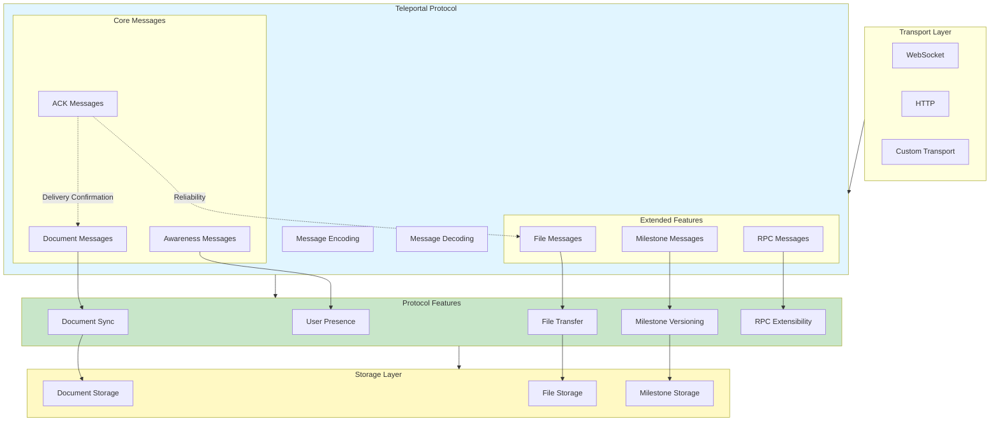

### System Integration

1. **Document Synchronization**: The core Y.js sync protocol (sync-step-1, sync-step-2, updates) ensures all clients have consistent document state. The bidirectional sync allows both client and server to request missing updates.

2. **Awareness System**: Runs in parallel with document sync, providing real-time presence information. This enables collaborative features like showing cursors and selections without affecting document state.

3. **File Transfer**: Uses the same message infrastructure but with chunked transfer and Merkle tree verification. Files are content-addressable (identified by Merkle root hash), enabling deduplication and integrity verification.

4. **Milestone Management**: Built on top of document sync, milestones capture document snapshots at specific points. The lazy loading design (metadata first, snapshots on demand) enables efficient browsing of document history.

5. **RPC System**: Provides extensibility for custom operations without modifying core protocol. This allows applications to add domain-specific features while maintaining protocol compatibility.

6. **Message Acknowledgment**: ACK messages enable reliable delivery tracking, particularly important for file transfers where chunks must be verified and confirmed.

7. **Transport Layer**: The protocol is transport-agnostic, working over WebSockets, HTTP, or any binary-capable transport. The message format is self-contained and doesn't depend on transport-specific features.

### Message Flow Integration

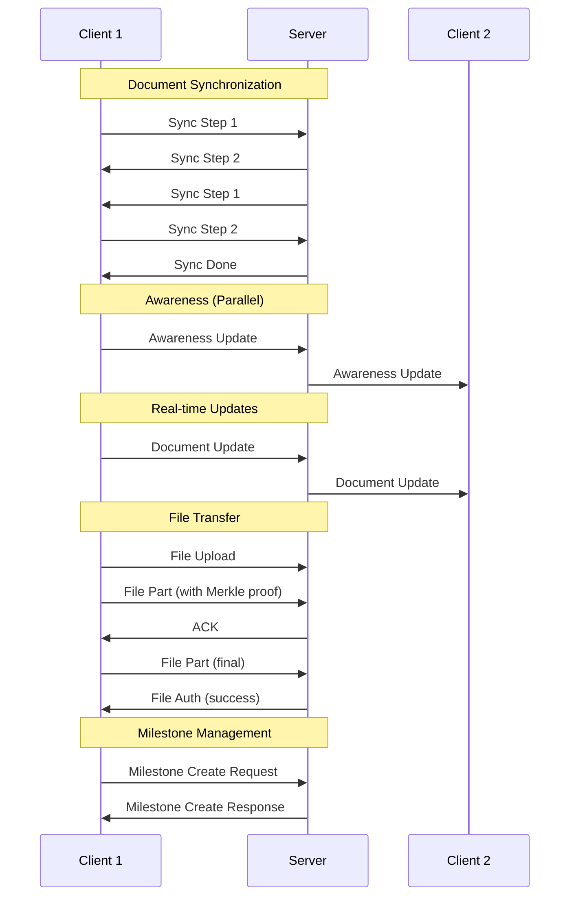

All these systems work together through the unified message format, enabling efficient, type-safe, and extensible collaborative editing while maintaining compatibility with the Y.js ecosystem.
