This document provides a comprehensive specification of the Teleportal protocol, a binary messaging protocol built on top of Y.js for real-time collaborative document synchronization and awareness updates. It describes how all the pieces fit together to enable efficient, type-safe communication for collaborative editing applications.

## Protocol Overview

The Teleportal protocol is designed for efficient transmission of Y.js collaborative editing messages over various transport layers. It defines five wire message types — document sync, awareness, ack, presence, and RPC — all with optional encryption and robust error handling. Higher-level features (file transfers, milestones, attribution, key distribution) are all built **on top of the RPC message type**, not as dedicated wire types.

The protocol is built around a flexible message structure that enables:

- **Document Synchronization**: Bidirectional sync of Y.js documents between clients and server
- **Awareness Updates**: Real-time user cursor/selection information
- **Presence**: Client join/leave/heartbeat tracking
- **RPC Operations**: Extensible custom operations (file transfer, milestones, attribution, key registry, and your own methods)
- **Message Acknowledgment**: Delivery confirmation for reliable message handling

## Message Format

### Base Message Structure

All Teleportal messages follow this base structure:

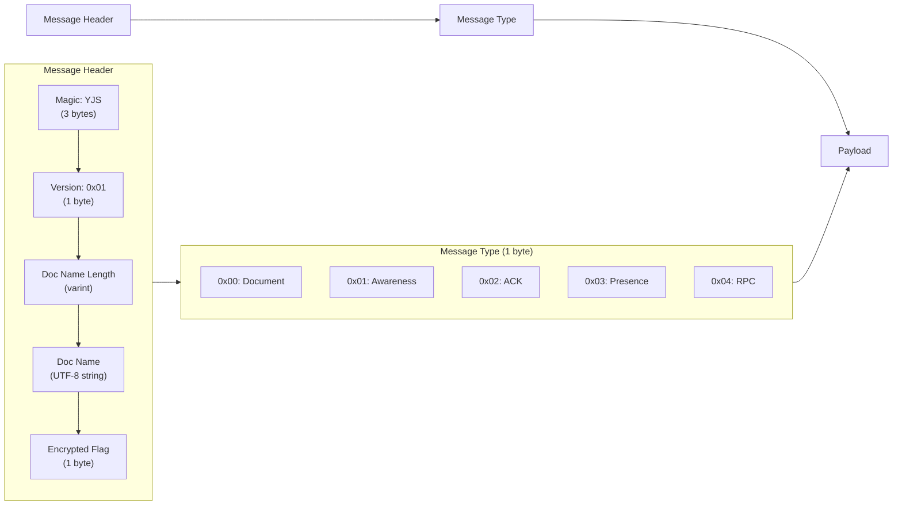
```mermaid
graph LR
    A[Message Header] --> B[Message Type]
    B --> C[Payload]

    subgraph Header["Message Header"]
        H1["Magic: YJS<br/>(3 bytes)"]
        H2["Version: 0x01<br/>(1 byte)"]
        H3["Doc Name Length<br/>(varint)"]
        H4["Doc Name<br/>(UTF-8 string)"]
        H5["Encrypted Flag<br/>(1 byte)"]
        H1 --> H2 --> H3 --> H4 --> H5
    end

    subgraph Type["Message Type (1 byte)"]
        T1["0x00: Document"]
        T2["0x01: Awareness"]
        T3["0x02: ACK"]
        T4["0x03: Presence"]
        T5["0x04: RPC"]
    end

    Header --> Type
    Type --> C
```

| Field           | Size    | Value                     |
| --------------- | ------- | ------------------------- |
| Magic Number    | 3 bytes | `0x59 0x4A 0x53` ("YJS")  |
| Version         | 1 byte  | `0x01`                    |
| Doc Name Length | varint  | length                    |
| Doc Name        | string  | UTF-8 string              |
| Encrypted Flag  | 1 byte  | `0x00`=false, `0x01`=true |
| Message Type    | 1 byte  | `0x00`–`0x04`             |

**Note**: The document name is an empty string for ack messages (they are not tied to a specific document).

### Message Type Hierarchy

The protocol organizes messages into categories, each with specific subtypes:

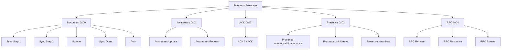
```mermaid
graph TD
    A[Teleportal Message] --> B[Document 0x00]
    A --> C[Awareness 0x01]
    A --> D[ACK 0x02]
    A --> P[Presence 0x03]
    A --> F[RPC 0x04]

    B --> B1[Sync Step 1]
    B --> B2[Sync Step 2]
    B --> B3[Update]
    B --> B4[Sync Done]
    B --> B5[Auth]

    C --> C1[Awareness Update]
    C --> C2[Awareness Request]

    D --> D1[ACK / NACK]

    P --> P1[Presence Announce/Unannounce]
    P --> P2[Presence Join/Leave]
    P --> P3[Presence Heartbeat]

    F --> F1[RPC Request]
    F --> F2[RPC Response]
    F --> F3[RPC Stream]
```

**Note**: Milestones, file transfers, attribution, and key distribution are **not** dedicated wire message types. They are all RPC methods carried by the RPC message (type `0x04`) — e.g. `milestoneList`/`milestoneCreate`, `fileUpload`/`fileDownload`, `attributionActivity`/`attributionGet`. Only the five wire types above (`0x00`–`0x04`) exist at the protocol level.

## Document Messages (Type 0x00)

Document messages handle Y.js document synchronization and updates. They form the core of the collaborative editing system.

### Document Message Structure

| Sub-type     | Code   | Payload                                                   |
| ------------ | ------ | --------------------------------------------------------- |
| Sync Step 1  | `0x00` | State Vector (`varUint8Array`)                            |
| Sync Step 2  | `0x01` | Version byte (1=V1, 2=V2) + Y.js Update (`varUint8Array`) |
| Doc Update   | `0x02` | Version byte (1=V1, 2=V2) + Y.js Update (`varUint8Array`) |
| Sync Done    | `0x03` | (no payload)                                              |
| Auth Message | `0x04` | Permission (1 byte) + Reason (`varString`)                |

Updates (sync-step-2 and update) carry a leading version byte (`1` = V1, `2` = V2) so the receiver knows how to apply them.

### Document Synchronization Messages

The document synchronization process uses a bidirectional sync protocol to ensure all clients have consistent document state:

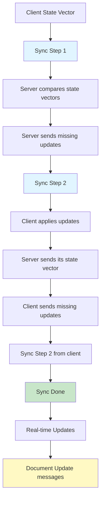
```mermaid
graph TD
    A[Client State Vector] --> B[Sync Step 1]
    B --> C[Server compares state vectors]
    C --> D[Server sends missing updates]
    D --> E[Sync Step 2]
    E --> F[Client applies updates]
    F --> G[Server sends its state vector]
    G --> H[Client sends missing updates]
    H --> I[Sync Step 2 from client]
    I --> J[Sync Done]
    J --> K[Real-time Updates]
    K --> L[Document Update messages]

    style B fill:#e1f5ff
    style E fill:#e1f5ff
    style J fill:#c8e6c9
    style L fill:#fff9c4
```

#### Sync Step 1 (0x00)

**Purpose**: Initiates synchronization by sending local state vector  
**Payload**: Y.js state vector as variable-length byte array  
**Usage**: Client sends this to request updates from server. The state vector represents what the client knows about the document's current state.

#### Sync Step 2 (0x01)

**Purpose**: Responds to Sync Step 1 with missing updates  
**Payload**: Y.js update containing missing operations  
**Usage**: Server responds with updates not present in client's state. This enables efficient synchronization by only sending what's needed.

#### Document Update (0x02)

**Purpose**: Sends incremental document changes  
**Payload**: Y.js update containing new operations  
**Usage**: Real-time propagation of document changes after initial sync is complete.

#### Sync Done (0x03)

**Purpose**: Indicates synchronization completion  
**Payload**: None  
**Usage**: Signals that both sync steps have been completed and the client is now in sync with the server.

#### Auth Message (0x04)

**Purpose**: Handles authentication and authorization  
**Payload**: Permission flag (1 byte) + reason string (`varString`)  
**Usage**: Server sends to grant/deny access with explanation. Used when a client attempts to access a document they don't have permission for.

## ACK Messages (Type 0x02)

ACK messages provide message delivery confirmation (and negative acknowledgement / NACK), allowing senders to know when their messages have been received and processed — or that they should retry later.

### ACK Message Structure

The ACK payload is:

```
[varString: messageId]
[uint8: flags]               bit 0 = has retryAfter, bit 1 = has error
[varUint: retryAfter]?       present if bit 0 set (ms to wait before retrying)
[varString: error]?          present if bit 1 set
```

**Purpose**: Acknowledges (or negatively acknowledges) receipt of a specific message  
**Payload**: The `messageId` of the message being acknowledged, encoded as a `varString`, followed by a flags byte and the optional `retryAfter` / `error` fields  
**Usage**:

- Confirms delivery of file chunks during uploads (a NACK with `retryAfter` sheds load and drives client retransmission)
- Allows senders to track which messages have been received
- The `messageId` is the message's content fingerprint — a 64-bit FNV-1a hash of the encoded bytes rendered as 16 lowercase hex characters (see [Message IDs](#message-ids))

**Note**: ACK messages do not have a document name and are not tied to a specific document context.

## Awareness Messages (Type 0x01)

Awareness messages handle user presence and cursor information in collaborative sessions, enabling real-time collaboration features like showing where other users are editing.

### Awareness Message Structure

| Msg Type          | Code   | Payload                              |
| ----------------- | ------ | ------------------------------------ |
| Awareness Update  | `0x00` | Y.js Awareness Update (varint array) |
| Awareness Request | `0x01` | (no payload)                         |

### Awareness Message Types

#### Awareness Update (0x00)

**Purpose**: Sends user presence and cursor information  
**Payload**: Y.js awareness update as variable-length byte array  
**Usage**: Propagates user activity, cursor position, selection state, and other presence information to all connected clients.

#### Awareness Request (0x01)

**Purpose**: Requests current awareness state  
**Payload**: None  
**Usage**: Client requests current user presence information when joining a document or when awareness state is needed.

## Presence Messages (Type 0x03)

Presence messages track which clients are in a document (join/leave/heartbeat), distinct from Y.js awareness (cursor/selection state). Presence is a **dedicated wire type** (`0x03`).

| Sub-type            | Code   | Payload                                                                                                            |
| ------------------- | ------ | ------------------------------------------------------------------------------------------------------------------ |
| Presence Announce   | `0x00` | `[varUint: awarenessId]`                                                                                           |
| Presence Join       | `0x01` | `[varUint: awarenessId] [varString: clientId] [varString: userId] [any: data]`                                     |
| Presence Leave      | `0x02` | (same shape as join)                                                                                               |
| Presence Heartbeat  | `0x03` | `[varUint: count]` then per client: `[varUint: awarenessId] [varString: clientId] [varString: userId] [any: data]` |
| Presence Unannounce | `0x04` | `[varUint: awarenessId]`                                                                                           |

## File Transfer (RPC methods)

File transfer is **not** a dedicated wire message type. It is implemented entirely as RPC (type `0x04`) using two methods — `fileUpload` and `fileDownload` — with streamed chunks. `fileUpload` uses the RPC "multipart" method kind (an initiation request plus a chunk stream); `fileDownload` is a request-response whose response streams the file parts back. Files are chunked and verified with a Merkle tree so transfers are content-addressed, resumable, and deduplicated.

### RPC method shapes

The request/response/stream payloads (encoded inside the RPC envelope, see [RPC Messages](#rpc-messages-type-0x04)) are:

- **`fileUpload` request** — `{ fileId, filename, size, mimeType, lastModified, encrypted, chunkSize? }`. Here `fileId` is the **content-addressed Merkle root** (the `contentId`), which the client computes by encrypting the whole file and folding its Merkle tree _before_ sending the request. This makes the id stable across retries — the basis for resume and dedup.
- **`fileUpload` response** — `{ fileId, allowed, reason?, statusCode?, chunkSize?, existingChunks?, alreadyExists?, chunkSizeMismatch? }`. `alreadyExists: true` means the content already exists durably (dedup hit — the client streams nothing); `existingChunks` lists chunks the server already has (resume). `chunkSizeMismatch` asks the client to re-chunk at the server's size.
- **`fileUpload` stream** (per chunk) — `{ fileId, chunkIndex, chunkData, merkleProof, totalChunks, bytesUploaded, encrypted }`. On **upload** the stream omits per-chunk proofs (`merkleProof: []`) — the server recomputes the tree from stored chunks and verifies it equals the client-claimed `contentId`. On **download** the server populates `merkleProof` and the client verifies each chunk.
- **`fileDownload` request** — `{ fileId }` (the Merkle root / `contentId`).
- **`fileDownload` response** — `{ fileId, filename, size, mimeType, lastModified, encrypted, allowed, reason?, statusCode?, totalChunks? }`, followed by a stream of file parts.

Errors (permission denied, not found, size limit) surface through the normal RPC error channel (status code + details), not through a dedicated wire message.

### File Chunking and Merkle Trees

Files are split into **1MB chunks** (configurable) for efficient transfer. Each chunk is hashed using SHA-256, and a Merkle tree is constructed to verify file integrity.

#### Merkle Tree Structure

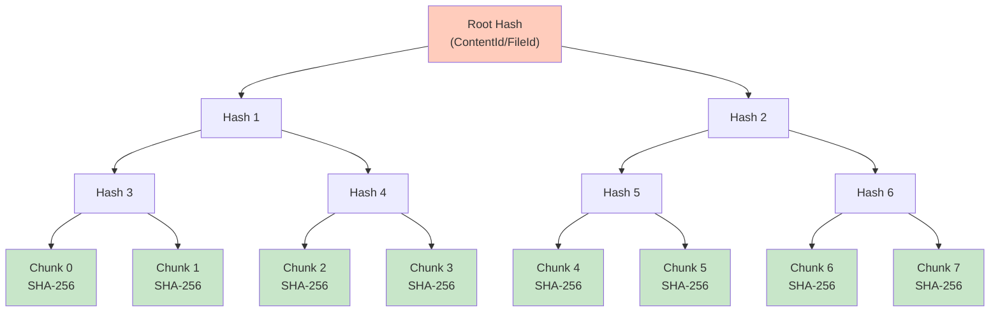
```mermaid
graph TD
    Root["Root Hash<br/>(ContentId/FileId)"] --> H1["Hash 1"]
    Root --> H2["Hash 2"]

    H1 --> H3["Hash 3"]
    H1 --> H4["Hash 4"]
    H2 --> H5["Hash 5"]
    H2 --> H6["Hash 6"]

    H3 --> C0["Chunk 0<br/>SHA-256"]
    H3 --> C1["Chunk 1<br/>SHA-256"]
    H4 --> C2["Chunk 2<br/>SHA-256"]
    H4 --> C3["Chunk 3<br/>SHA-256"]
    H5 --> C4["Chunk 4<br/>SHA-256"]
    H5 --> C5["Chunk 5<br/>SHA-256"]
    H6 --> C6["Chunk 6<br/>SHA-256"]
    H6 --> C7["Chunk 7<br/>SHA-256"]

    style Root fill:#ffccbc
    style C0 fill:#c8e6c9
    style C1 fill:#c8e6c9
    style C2 fill:#c8e6c9
    style C3 fill:#c8e6c9
    style C4 fill:#c8e6c9
    style C5 fill:#c8e6c9
    style C6 fill:#c8e6c9
    style C7 fill:#c8e6c9
```

**Structure Components**:

- **Leaf nodes**: SHA-256 hash of each chunk
- **Internal nodes**: Hash of concatenated child hashes
- **Root hash**: Content ID used to uniquely identify the file
- **Merkle proof**: Path from chunk hash to root (sibling hashes at each level)

#### Merkle Proof Example

When sending Chunk 2, the client includes a Merkle proof that allows the server to verify the chunk:

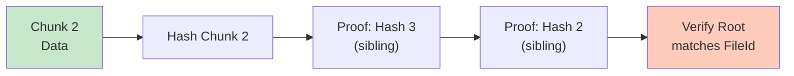
```mermaid
graph LR
    C2["Chunk 2<br/>Data"] --> H2["Hash Chunk 2"]
    H2 --> P1["Proof: Hash 3<br/>(sibling)"]
    P1 --> P2["Proof: Hash 2<br/>(sibling)"]
    P2 --> Verify["Verify Root<br/>matches FileId"]

    style C2 fill:#c8e6c9
    style Verify fill:#ffccbc
```

#### Chunk Verification

The verification process ensures data integrity by reconstructing the Merkle tree path:

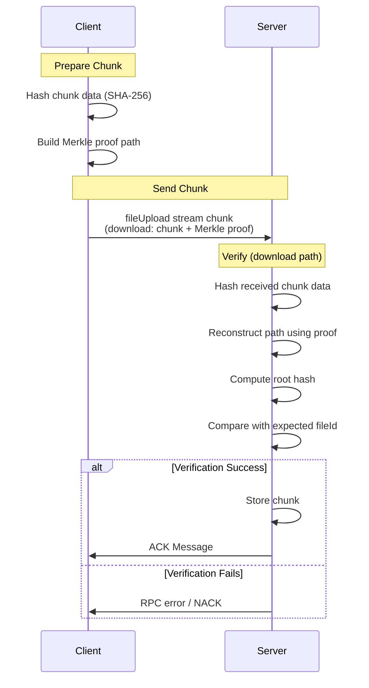
```mermaid
sequenceDiagram
    participant C as Client
    participant S as Server

    Note over C: Prepare Chunk
    C->>C: Hash chunk data (SHA-256)
    C->>C: Build Merkle proof path

    Note over C,S: Send Chunk
    C->>S: fileUpload stream chunk<br/>(download: chunk + Merkle proof)

    Note over S: Verify (download path)
    S->>S: Hash received chunk data
    S->>S: Reconstruct path using proof
    S->>S: Compute root hash
    S->>S: Compare with expected fileId

    alt Verification Success
        S->>S: Store chunk
        S->>C: ACK Message
    else Verification Fails
        S->>C: RPC error / NACK
    end
```

> **Note**: On **upload** the client omits per-chunk proofs (`merkleProof: []`) and the server recomputes the whole tree at completion, verifying it equals the client-claimed `contentId`. On **download** the server generates the proofs and the client verifies each chunk against the root. Download is the integrity boundary.

**Verification Steps (download)**:

1. **Server sends**: Chunk data + Merkle proof (sibling hashes) + Chunk index
2. **Client receives**: Hashes the chunk data to get leaf hash
3. **Client reconstructs**: Uses proof hashes to build path from leaf to root
4. **Client verifies**: Compares computed root hash with expected fileId
5. **Client rejects** the chunk if verification fails

## RPC Messages (Type 0x04)

RPC messages provide extensible custom operations for application-specific needs. They enable the protocol to be extended without modifying the core message types. Built-in features (milestones, file transfer, attribution, key registry) are all RPC methods.

### RPC Message Structure

The RPC payload is:

```
[varString: method]
[uint8: requestType]              0=request, 1=stream, 2=response
[varString: originalRequestId]?   present for stream/response only
[uint8: isError]                  0=success, 1=error
```

Success payload: `[varUint8Array: serialized payload]`.  
Error payload: `[varUint: statusCode] [varString: details] [uint8: hasPayload] [any: payload]?`.

### Request Types

#### RPC Request (requestType 0)

**Purpose**: Client requests a custom operation  
**Payload**: Method name + serialized request data  
**Usage**: Enables custom operations beyond the standard protocol messages.

#### RPC Stream (requestType 1)

**Purpose**: Streaming data for an in-flight RPC operation  
**Payload**: Method name + `originalRequestId` + serialized stream chunk  
**Usage**: Carries streamed chunks (e.g. file parts) tied back to the originating request.

#### RPC Response (requestType 2)

**Purpose**: Server responds to an RPC request  
**Payload**: Method name + `originalRequestId` + success or error payload  
**Usage**: Returns the result of an RPC operation.

A custom serializer/deserializer can override the default `writeAny`/`readAny` encoding for RPC payloads.

## Special Message Types

### Ping/Pong Messages

Keep-alive messages for connection health monitoring:

**Ping Message:**

| Field        | Size    | Value                          |
| ------------ | ------- | ------------------------------ |
| Magic Number | 3 bytes | `0x59 0x4A 0x53` ("YJS")       |
| Ping         | 4 bytes | `0x70 0x69 0x6E 0x67` ("ping") |

**Pong Message:**

| Field        | Size    | Value                          |
| ------------ | ------- | ------------------------------ |
| Magic Number | 3 bytes | `0x59 0x4A 0x53` ("YJS")       |
| Pong         | 4 bytes | `0x70 0x6F 0x6E 0x67` ("pong") |

### Message Arrays

Multiple messages can be batched into a single transmission for efficiency. Messages are concatenated sequentially without an explicit count field:

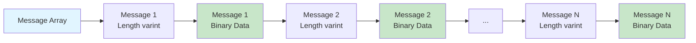
```mermaid
graph LR
    A[Message Array] --> B["Message 1<br/>Length varint"]
    B --> C["Message 1<br/>Binary Data"]
    C --> D["Message 2<br/>Length varint"]
    D --> E["Message 2<br/>Binary Data"]
    E --> F["..."]
    F --> G["Message N<br/>Length varint"]
    G --> H["Message N<br/>Binary Data"]

    style A fill:#e1f5ff
    style C fill:#c8e6c9
    style E fill:#c8e6c9
    style H fill:#c8e6c9
```

| Component        | Encoding                                        |
| ---------------- | ----------------------------------------------- |
| Message 1 Length | varint                                          |
| Message 1 Data   | BinaryMessage                                   |
| Message 2 Length | varint                                          |
| Message 2 Data   | BinaryMessage                                   |
| ...              | (repeated for all messages until end of buffer) |

**Encoding**: Each message in the array is encoded as a varint-prefixed byte array. The decoder reads messages sequentially until the buffer is exhausted.

**Usage**: Useful for reducing network overhead when sending multiple related messages (e.g., multiple document updates or file chunks).

## Encoding Details

### Message Encoding Flow

The encoding process transforms structured message data into binary format:

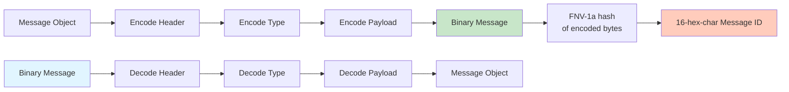
```mermaid
graph LR
    A[Message Object] --> B[Encode Header]
    B --> C[Encode Type]
    C --> D[Encode Payload]
    D --> E[Binary Message]
    E --> F[FNV-1a hash<br/>of encoded bytes]
    F --> G[16-hex-char Message ID]

    H[Binary Message] --> I[Decode Header]
    I --> J[Decode Type]
    J --> K[Decode Payload]
    K --> L[Message Object]

    style E fill:#c8e6c9
    style G fill:#ffccbc
    style H fill:#e1f5ff
```

### Message IDs

Every message has a unique identifier computed from its encoded bytes:

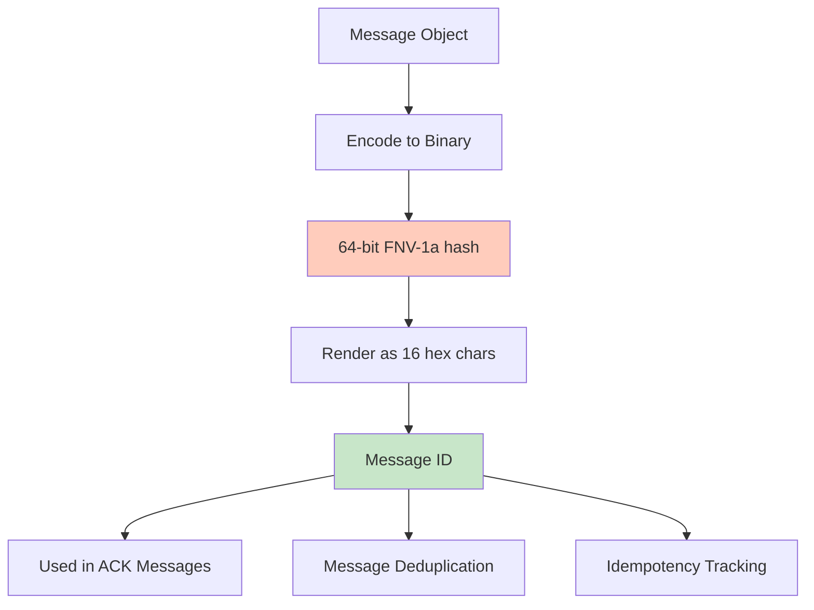
```mermaid
graph TD
    A[Message Object] --> B[Encode to Binary]
    B --> C[64-bit FNV-1a hash]
    C --> D[Render as 16 hex chars]
    D --> E[Message ID]
    E --> F[Used in ACK Messages]
    E --> G[Message Deduplication]
    E --> H[Idempotency Tracking]

    style C fill:#ffccbc
    style E fill:#c8e6c9
```

- **Computation**: a fast 64-bit **FNV-1a-style hash** of the message's encoded bytes — a content fingerprint, **not** SHA-256 and **not** base64
- **Encoding**: rendered as 16 lowercase hex characters; carried as a `varString` in ACK messages
- **Purpose**: Enables message deduplication, acknowledgment tracking, and idempotency
- **Lazy Computation**: Message IDs are computed on first access and cached; `valueOf()` returns the id

### Variable-Length Encoding

The protocol uses variable-length encoding for efficiency:

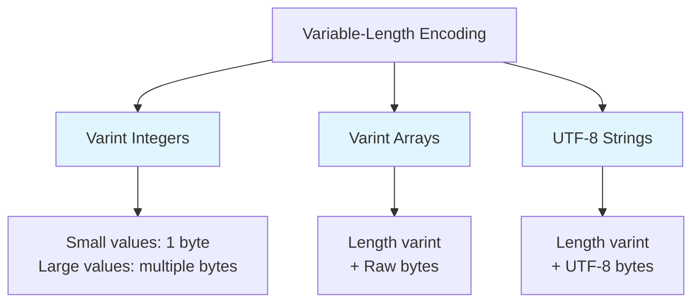
```mermaid
graph TD
    A[Variable-Length Encoding] --> B[Varint Integers]
    A --> C[Varint Arrays]
    A --> D[UTF-8 Strings]

    B --> B1["Small values: 1 byte<br/>Large values: multiple bytes"]
    C --> C1["Length varint<br/>+ Raw bytes"]
    D --> D1["Length varint<br/>+ UTF-8 bytes"]

    style B fill:#e1f5ff
    style C fill:#e1f5ff
    style D fill:#e1f5ff
```

#### Variable-Length Integers (varint)

- Used for lengths and counts
- Follows lib0 encoding standard
- Efficient for small values, expandable for large ones

#### Variable-Length Byte Arrays (varint array)

- Length-prefixed byte arrays
- Length encoded as varint, followed by raw bytes
- Used for Y.js updates, state vectors, and string data

#### String Encoding

- UTF-8 encoded strings
- Length-prefixed with varint length
- Used for document names and reason strings

## Message Flow Examples

### Document Synchronization Flow

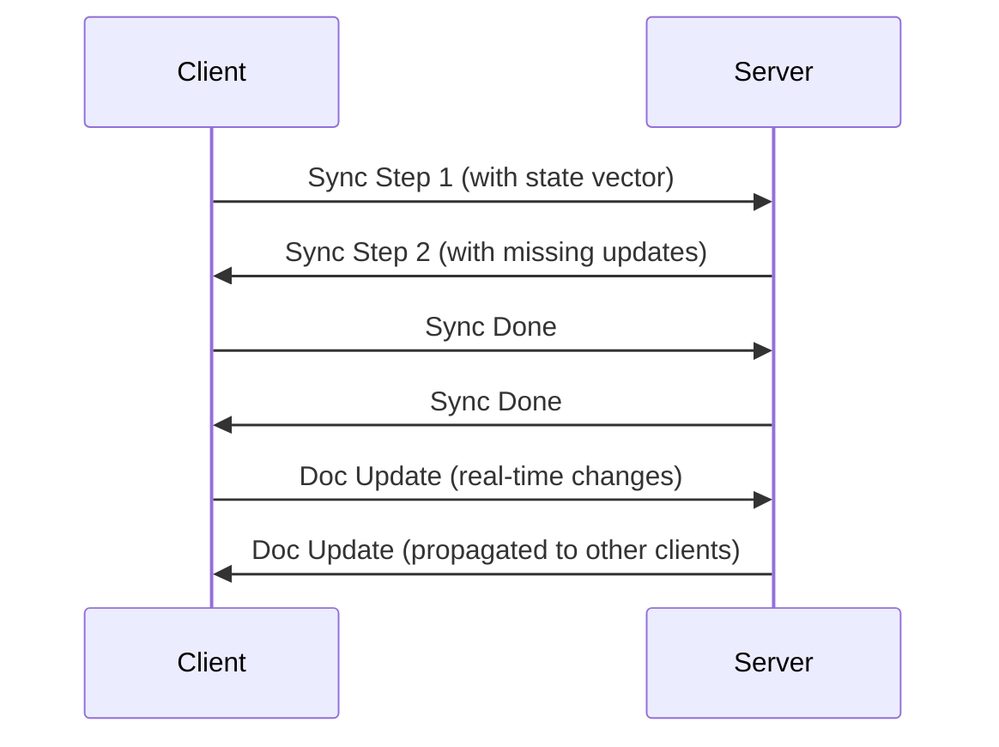
```mermaid
sequenceDiagram
    participant Client
    participant Server

    Client->>Server: Sync Step 1 (with state vector)
    Server->>Client: Sync Step 2 (with missing updates)
    Client->>Server: Sync Done
    Server->>Client: Sync Done
    Client->>Server: Doc Update (real-time changes)
    Server->>Client: Doc Update (propagated to other clients)
```

### Awareness Flow

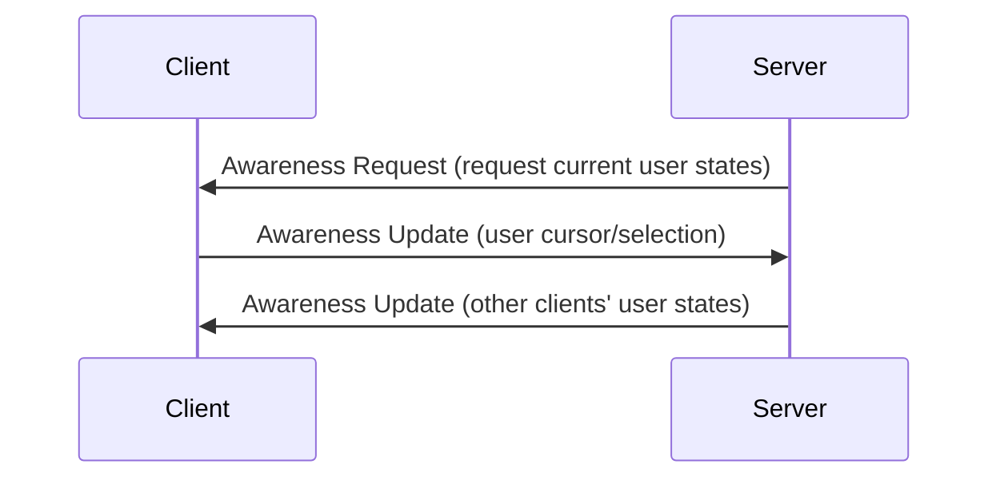
```mermaid
sequenceDiagram
    participant Client
    participant Server

    Server->>Client: Awareness Request (request current user states)
    Client->>Server: Awareness Update (user cursor/selection)
    Server->>Client: Awareness Update (other clients' user states)
```

### File Upload Flow

```mermaid
sequenceDiagram
    participant Client
    participant Server

    Client->>Client: Encrypt file, fold Merkle root → contentId
    Client->>Server: fileUpload request (fileId=contentId, metadata, chunkSize)
    Note over Server: Permission check; dedup/resume via contentId
    Server->>Client: fileUpload response (allowed, existingChunks?, alreadyExists?)
    Client->>Server: fileUpload stream (chunk 0)
    Server->>Client: ACK
    Note over Client,Server: ... (missing chunks only)
    Client->>Server: fileUpload stream (final chunk)
    Note over Server: Recompute Merkle tree,<br/>verify == contentId,<br/>move to durable storage
    Server->>Client: ACK (upload complete)
```

### File Download Flow

```mermaid
sequenceDiagram
    participant Client
    participant Server

    Client->>Server: fileDownload request (fileId: merkle root hash)
    Note over Server: Looks up file by fileId/contentId
    Server->>Client: fileDownload stream (chunk 0 + merkle proof)
    Note over Client: Verifies chunk
    Server->>Client: fileDownload stream (chunk 1 + merkle proof)
    Note over Client: Verifies chunk
    Note over Client,Server: ... (more chunks)
    Server->>Client: fileDownload stream (final chunk + merkle proof)
    Note over Client: Verifies all chunks,<br/>reconstructs file
    Server->>Client: fileDownload response (metadata; or RPC error if not found)
```

### Milestone Operations Flow

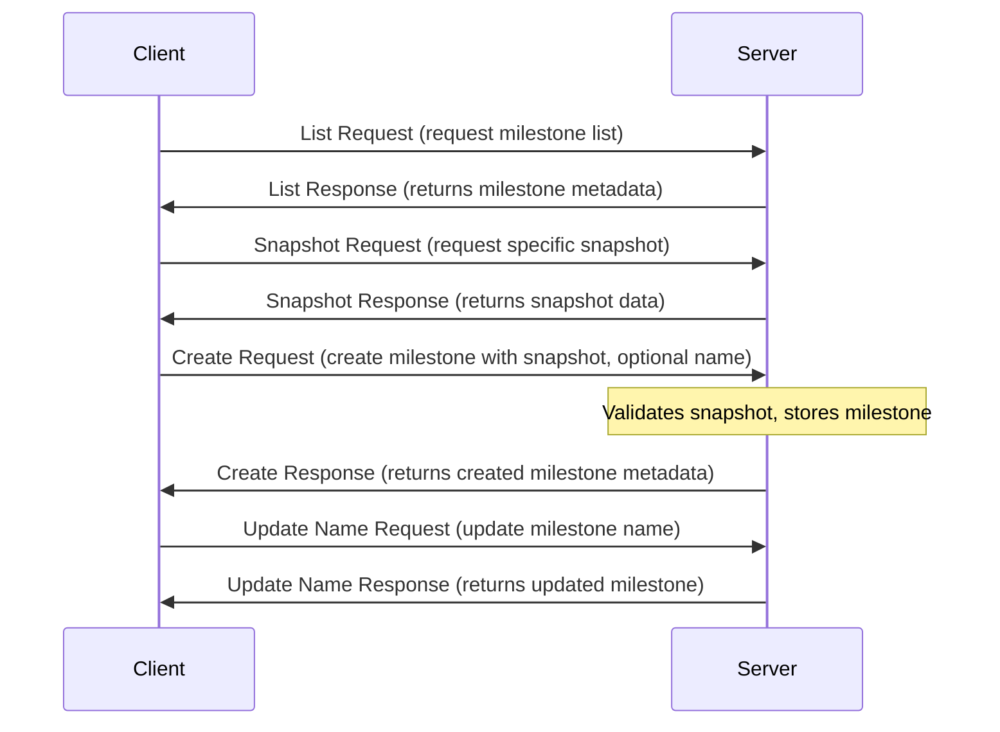
```mermaid
sequenceDiagram
    participant Client
    participant Server

    Client->>Server: List Request (request milestone list)
    Server->>Client: List Response (returns milestone metadata)
    Client->>Server: Snapshot Request (request specific snapshot)
    Server->>Client: Snapshot Response (returns snapshot data)
    Client->>Server: Create Request (create milestone with snapshot, optional name)
    Note over Server: Validates snapshot, stores milestone
    Server->>Client: Create Response (returns created milestone metadata)
    Client->>Server: Update Name Request (update milestone name)
    Server->>Client: Update Name Response (returns updated milestone)
```

## Error Handling

The protocol includes robust error handling:

- **Magic Number Validation**: Ensures message is valid Teleportal format (must start with `0x59 0x4A 0x53` / "YJS")
- **Version Checking**: Verifies protocol version compatibility (currently only version `0x01` is supported)
- **Type Validation**: Validates message and payload types
- **Length Validation**: Ensures proper message boundaries using varint encoding
- **Decoding Errors**: Invalid messages throw descriptive errors with context about the failure
- **RPC Errors**: File, milestone, attribution, and other RPC operations fail through the RPC error payload (status code + details), which the client surfaces as an `RpcOperationError`

## Security Considerations

- **Encryption Flag**: Built-in support for encrypted payloads at the message level
- **Authentication**: Auth messages provide access control for documents and operations
- **Validation**: All inputs are validated before processing
- **Merkle Tree Verification**: File transfers use cryptographic proofs to ensure data integrity
- **Message IDs**: A non-cryptographic content fingerprint (64-bit FNV-1a) used for deduplication and ack correlation. It is _not_ a security primitive — do not rely on it for authenticity or anti-replay

## How It All Fits Together

The Teleportal protocol integrates multiple subsystems into a cohesive collaborative editing platform. The following diagram illustrates how all components interact:

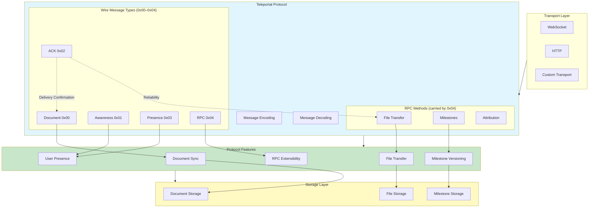
```mermaid
graph TB
    subgraph Transport["Transport Layer"]
        WS[WebSocket]
        HTTP[HTTP]
        CUSTOM[Custom Transport]
    end

    subgraph Protocol["Teleportal Protocol"]
        subgraph Core["Wire Message Types (0x00–0x04)"]
            DOC[Document 0x00]
            AWARE[Awareness 0x01]
            ACK[ACK 0x02]
            PRESENCE[Presence 0x03]
            RPC[RPC 0x04]
        end

        subgraph Extended["RPC Methods (carried by 0x04)"]
            FILE[File Transfer]
            MILESTONE[Milestones]
            ATTR[Attribution]
        end

        ENCODE[Message Encoding]
        DECODE[Message Decoding]
    end

    subgraph Features["Protocol Features"]
        SYNC[Document Sync]
        USERPRESENCE[User Presence]
        TRANSFER[File Transfer]
        VERSIONING[Milestone Versioning]
        EXTENSIBILITY[RPC Extensibility]
    end

    subgraph Storage["Storage Layer"]
        DOC_STORE[Document Storage]
        FILE_STORE[File Storage]
        MILESTONE_STORE[Milestone Storage]
    end

    Transport --> Protocol
    Protocol --> Features
    Features --> Storage

    DOC --> SYNC
    AWARE --> USERPRESENCE
    PRESENCE --> USERPRESENCE
    FILE --> TRANSFER
    MILESTONE --> VERSIONING
    RPC --> EXTENSIBILITY

    ACK -.->|Reliability| FILE
    ACK -.->|Delivery Confirmation| DOC

    SYNC --> DOC_STORE
    TRANSFER --> FILE_STORE
    VERSIONING --> MILESTONE_STORE

    style Protocol fill:#e1f5ff
    style Features fill:#c8e6c9
    style Storage fill:#fff9c4
```

### System Integration

1. **Document Synchronization**: The core Y.js sync protocol (sync-step-1, sync-step-2, updates) ensures all clients have consistent document state. The bidirectional sync allows both client and server to request missing updates.

2. **Awareness System**: Runs in parallel with document sync, providing real-time presence information. This enables collaborative features like showing cursors and selections without affecting document state.

3. **File Transfer**: An RPC method (`fileUpload`/`fileDownload`) with chunked streaming and Merkle tree verification. Files are content-addressable (identified by Merkle root hash), enabling deduplication and integrity verification.

4. **Milestone Management**: An RPC method group (`milestoneList`/`milestoneCreate`/…) that captures document snapshots at specific points. The lazy loading design (metadata first, snapshots on demand) enables efficient browsing of document history.

5. **RPC System**: The single extension point (wire type `0x04`). File transfer, milestones, attribution, and key registry are all built on it, as are your own custom methods — no core protocol changes required.

6. **Message Acknowledgment**: ACK messages enable reliable delivery tracking, particularly important for file transfers where chunks must be verified and confirmed.

7. **Transport Layer**: The protocol is transport-agnostic, working over WebSockets, HTTP, or any binary-capable transport. The message format is self-contained and doesn't depend on transport-specific features.

### Message Flow Integration

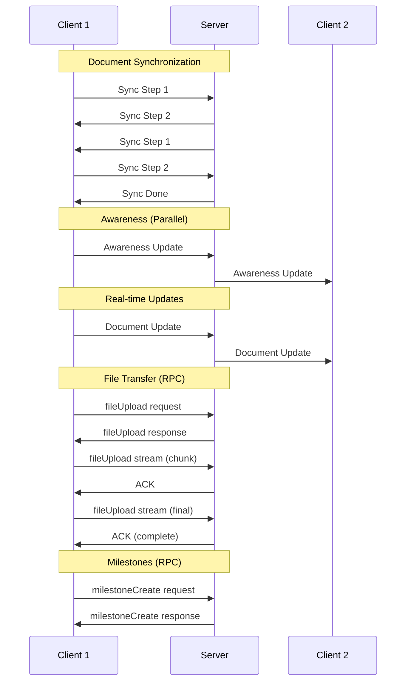
```mermaid
sequenceDiagram
    participant C1 as Client 1
    participant S as Server
    participant C2 as Client 2

    Note over C1,S: Document Synchronization
    C1->>S: Sync Step 1
    S->>C1: Sync Step 2
    S->>C1: Sync Step 1
    C1->>S: Sync Step 2
    S->>C1: Sync Done

    Note over C1,S: Awareness (Parallel)
    C1->>S: Awareness Update
    S->>C2: Awareness Update

    Note over C1,S: Real-time Updates
    C1->>S: Document Update
    S->>C2: Document Update

    Note over C1,S: File Transfer (RPC)
    C1->>S: fileUpload request
    S->>C1: fileUpload response
    C1->>S: fileUpload stream (chunk)
    S->>C1: ACK
    C1->>S: fileUpload stream (final)
    S->>C1: ACK (complete)

    Note over C1,S: Milestones (RPC)
    C1->>S: milestoneCreate request
    S->>C1: milestoneCreate response
```

All these systems work together through the unified message format, enabling efficient, type-safe, and extensible collaborative editing while maintaining compatibility with the Y.js ecosystem.
