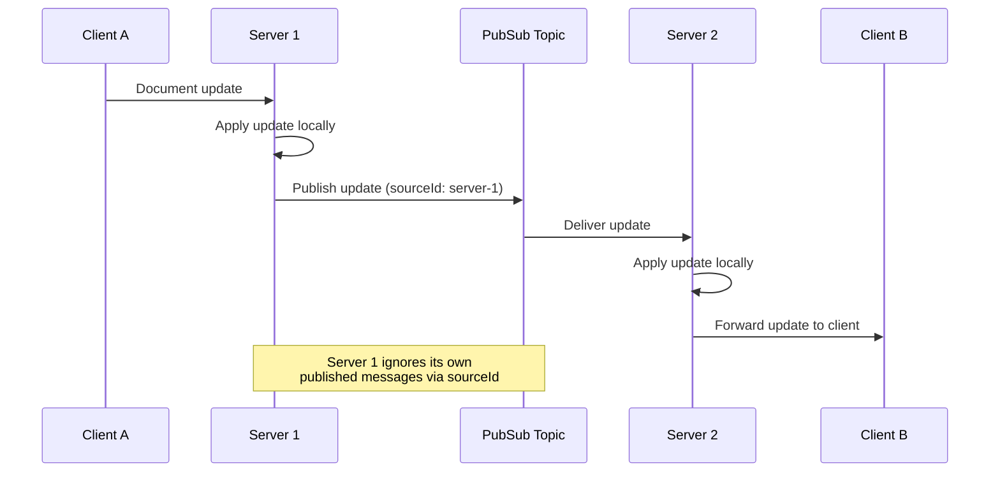

This guide covers scaling strategies for Teleportal deployments, from the simplest single-server setup to horizontally scaled clusters with PubSub coordination.

## Single-Node Deployment

A single-node deployment is the simplest model. One server instance handles all client connections, with in-memory or local storage and no coordination overhead.

This is a good fit for prototyping, small teams, or low-traffic applications where a single process can handle all concurrent sessions.

```typescript
import { Server } from "teleportal/server";

const server = new Server({
  storage: async (ctx) => {
    return documentStorage;
  },
});
```

No `pubSub` or `nodeId` configuration is needed. All clients connect to the same process, so document state is always consistent.

## Multi-Node with PubSub

When a single server is not enough, you can run multiple Teleportal instances behind a load balancer. The challenge is coordination: if Client A connects to Server 1 and Client B connects to Server 2, and both are editing the same document, the two servers need a way to exchange updates. Without PubSub, clients on different servers would diverge into inconsistent states.

A PubSub backend solves this by acting as a message bus between server instances. When one server receives a document update from a client, it publishes that update to a PubSub topic. Every other server subscribed to that topic receives the update and forwards it to its own connected clients.

### Message Flow



When Server 1 receives an update from Client A, it applies the update to its local document state and then publishes the update to the PubSub topic for that document. Server 2, which also has clients editing the same document, receives the update via its subscription and forwards it to Client B. The result is that both clients converge on the same document state, even though they are connected to different servers.

### Source ID Filtering

Every PubSub message includes a `sourceId` identifying the server that published it. When a server receives a message from the PubSub topic, it checks the `sourceId` and ignores messages it published itself. This prevents message loops where a server would re-process its own updates.

### Topic-Based Routing

Messages are routed to PubSub topics based on document ID (by default, `document/{documentId}`). Servers only subscribe to topics for documents that have active sessions. This means a server with no clients editing a particular document will not receive updates for that document, keeping the message volume proportional to actual activity.

## PubSub Implementation Options

Teleportal ships with two PubSub backends and an in-memory implementation for testing.

### Redis PubSub

Redis is widely supported, easy to set up, and familiar to most teams. It is a good choice for moderate scale.

```typescript
import { Server } from "teleportal/server";
import { RedisPubSub } from "teleportal/transports/redis";

const server = new Server({
  storage: async (ctx) => {
    return documentStorage;
  },
  pubSub: new RedisPubSub({
    path: "redis://localhost:6379",
  }),
  nodeId: process.env.NODE_ID || "node-1",
});
```

Trade-offs to be aware of:

- Messages are fire-and-forget. Redis PubSub does not persist messages or support replay. If a subscriber is temporarily disconnected, it will miss any messages published during that window.
- Fan-out to many subscribers on a single Redis instance can add latency under high load.
- Redis requires separate connections for publishing and subscribing. The `RedisPubSub` class manages this internally, creating two connections per instance.

### NATS

NATS is a lightweight, high-performance messaging system designed specifically for this kind of inter-service communication. It handles high message throughput well and supports clustering for availability.

```typescript
import { Server } from "teleportal/server";
import { NatsPubSub } from "teleportal/transports/nats";
import { connect } from "@nats-io/transport-node";

const server = new Server({
  storage: async (ctx) => {
    return documentStorage;
  },
  pubSub: new NatsPubSub(() => connect({ servers: "nats://localhost:4222" })),
  nodeId: process.env.NODE_ID || "node-1",
});
```

Trade-offs:

- NATS is additional infrastructure that may be less familiar to your team.
- Core NATS PubSub is also fire-and-forget (like Redis). For durability, NATS JetStream can persist messages, but Teleportal uses the core PubSub interface.
- NATS supports native clustering and leaf nodes for multi-region deployments.

### In-Memory PubSub

The in-memory PubSub implementation is useful for testing multi-server behavior in a single process. It is not shared across nodes and should never be used in production multi-node deployments.

### Running Multiple Instances

With either backend, run each instance with a unique `NODE_ID`:

```bash
# Instance 1
NODE_ID=node-1 PORT=3000 bun run server.ts

# Instance 2
NODE_ID=node-2 PORT=3001 bun run server.ts

# Instance 3
NODE_ID=node-3 PORT=3002 bun run server.ts
```

## PubSub Pressure and Considerations

PubSub becomes a bottleneck when many documents are actively edited simultaneously or when individual documents generate high update frequency (for example, many users typing rapidly in the same document). There are several strategies to reduce cross-server PubSub traffic.

### Co-locating Users

Use session affinity to route users who are editing the same document to the same server instance. When all collaborators on a document are on the same server, updates stay local and do not need to traverse the PubSub layer at all. PubSub is only needed for the (ideally rare) case where a document has active sessions on multiple servers.

### Document Affinity / Sticky Sessions

Route documents to specific servers using document ID hashing so that most updates stay local. Only documents that happen to span multiple servers (for example, during rebalancing) generate cross-server traffic.

### Monitoring PubSub Health

Watch these signals to detect PubSub pressure:

- **Message rates**: A sustained increase in published messages per second may indicate that session affinity is not working effectively.
- **Message latency**: Growing latency between publish and delivery suggests the PubSub backend is overloaded.
- **Subscriber counts per topic**: High subscriber counts on a single topic mean many servers are serving the same document. Consider improving session affinity to consolidate those sessions.

## Session Affinity Strategies

Session affinity ensures that clients editing the same document are routed to the same server, reducing cross-server coordination.

### Document ID Hashing

The simplest approach: compute `hash(documentId) % serverCount` and route to the corresponding server. This is deterministic and requires no shared state, but rebalancing when servers are added or removed causes all clients to reconnect.

```typescript
function getServerForDocument(documentId: string, serverCount: number): number {
  let hash = 0;
  for (let i = 0; i < documentId.length; i++) {
    hash = (hash * 31 + documentId.charCodeAt(i)) | 0;
  }
  return Math.abs(hash) % serverCount;
}
```

### Consistent Hashing

Consistent hashing minimizes rebalancing when servers are added or removed. Instead of rehashing all documents, only a fraction of documents are reassigned to new servers. This is the preferred approach for deployments that scale up and down frequently.

### Load Balancer Sticky Sessions

Configure your load balancer to route based on a document identifier in the request. Common approaches:

- **Header-based**: Route on an `X-Document-Id` header sent by the client.
- **Query parameter**: Route on a `document` query parameter in the WebSocket upgrade URL (for example, `wss://example.com/sync?document=my-doc`).
- **Cookie-based**: Set a cookie on the first connection and route subsequent requests to the same server.

### DNS-Based Routing

For regional deployments, route at the DNS level to send users to the nearest cluster. Within each region, use one of the above strategies for document-level affinity.

## Multi-Node with HTTP Load Balancer (No PubSub)

If you do not want to run a PubSub backend, you can still scale horizontally with a load balancer. The critical constraint is that **all clients editing the same document must connect to the same server instance**. Sticky sessions are mandatory, not optional. Without PubSub, there is no mechanism to synchronize document state between servers.

```typescript
const server = new Server({
  storage: async (ctx) => {
    // Shared storage backend (e.g., PostgreSQL, S3)
    return documentStorage;
  },
  // No pubSub configured
});
```

This model is simpler to operate (no PubSub infrastructure to manage), but it means that a single server failure will disconnect all clients for the documents it was serving. Those clients must reconnect to another server and reload the document from shared storage.

## Document Sharding

For very large deployments, you can shard documents across server groups. Each shard handles a subset of documents, and routing is determined by the document ID:

```typescript
function getShardForDocument(documentId: string, shardCount: number): number {
  let hash = 0;
  for (let i = 0; i < documentId.length; i++) {
    hash = (hash * 31 + documentId.charCodeAt(i)) | 0;
  }
  return Math.abs(hash) % shardCount;
}
```

Each shard can be an independent cluster with its own PubSub backend and storage, allowing you to scale different shards independently based on their load characteristics.

## Storage Scaling

Storage is independent of the server topology. You can use different backends for different storage types to optimize cost and performance:

```typescript
import { UnstorageMilestoneStorage } from "teleportal/storage";
import { PostgresDocumentStorage } from "teleportal/storage/postgres";
import { S3FileStorage } from "teleportal/storage/s3";
import { createStorage } from "unstorage";
import redisDriver from "unstorage/drivers/redis";

// PostgreSQL for document state (strong consistency, querying)
const documentStorage = new PostgresDocumentStorage(sql);

// S3 for file uploads (cheap, durable, high throughput)
const fileStorage = new S3FileStorage(s3Config);

// Redis (via unstorage) for milestones (fast reads, TTL support)
const redisStore = createStorage({ driver: redisDriver({ base: "milestone:" }) });
const milestoneStorage = new UnstorageMilestoneStorage(redisStore, { keyPrefix: "milestone" });
```

When scaling storage, consider:

- **Read replicas**: Offload read traffic from the primary database.
- **Connection pooling**: Use connection pools to avoid exhausting database connections as the number of server instances grows.
- **Regional replication**: Replicate storage across regions to reduce latency for geographically distributed users.

## Monitoring a Scaled Deployment

Monitoring becomes essential once you are running multiple server instances.

### Key Metrics Per Node

Each Teleportal server exposes Prometheus-compatible metrics:

- `teleportal_clients_active` -- current number of connected clients on this node
- `teleportal_sessions_active` -- current number of active document sessions on this node
- `teleportal_messages_total_all` -- total messages processed by this node (all types); `teleportal_messages_total` is the same count labeled by `type`

### Cross-Node Aggregation

Aggregate metrics across all nodes to understand total system load. Use Prometheus federation or a central metrics collector to combine per-node metrics into cluster-wide dashboards.

### Signs of Scaling Issues

- **Uneven session distribution**: Some servers are overloaded while others are idle. Improve your load balancing or session affinity strategy.
- **High PubSub message latency**: The PubSub backend is becoming a bottleneck. Consider improving session affinity to reduce cross-server traffic, or scaling the PubSub infrastructure itself.
- **Increasing storage operation durations**: Storage is under pressure. Add read replicas, improve connection pooling, or shard storage.

### Health Check Endpoints

Use the `/health` and `/status` endpoints for load balancer health checks. Configure your load balancer to remove unhealthy instances from the pool automatically. Note that the built-in `/health` handler is a liveness stub -- it returns `status: "healthy"` with an empty `checks` object whenever the process is up. For deeper readiness signals (storage or PubSub reachability), derive them from `/status` fields or extend the server's health logic.

See [Observability](/docs/guides/observability/) for full setup details on metrics, health endpoints, and structured logging.

## Next Steps

- [Pub/Sub Guide](/docs/guides/pub-sub/) -- Set up PubSub for multi-server coordination
- [Performance](/docs/advanced/performance/) -- Optimize throughput and latency
- [Observability](/docs/guides/observability/) -- Configure metrics, health checks, and logging
