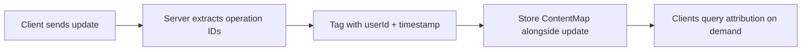
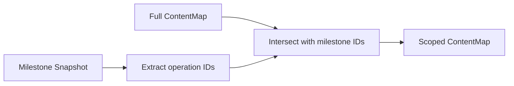

import { Aside } from "@astrojs/starlight/components";

Attribution tracks **who** inserted or deleted each piece of content in a Y.js document, and **when**. It answers questions like "who wrote this paragraph?" and "what changed between yesterday and today?" — the foundation for features like author highlighting, activity feeds, and audit trails.

## Overview

Every Y.js CRDT operation has a unique ID: `(clientID, clock)`. The attribution system maps these operation IDs to authorship metadata — userId, timestamp, and optional custom attributes — in a compact binary structure called a **ContentMap**.



The server computes and stores attribution automatically. Clients query it on demand via RPC — attribution data is **not** synced continuously, only fetched when requested.

## How It Works

### Server-Side: Computing Attribution

When a client sends a Y.js update, the server:

1. **Extracts operation IDs** from the update — which operations were inserted and which were deleted
2. **Tags** each operation range with the authenticated userId and current timestamp
3. **Encodes** the result as a binary ContentMap
4. **Stores** it alongside the update in storage

```typescript
// This happens automatically inside the server — no configuration needed
// beyond enabling attribution in your storage implementation.
```

The server emits a `document-attribution` event on every attributed update, which you can use for real-time integrations:

```typescript
server.on(
  "document-attribution",
  ({ documentId, namespacedDocumentId, sessionId, userId, timestamp, contentMap }) => {
    // React to attribution changes in real-time
  },
);
```

### Client-Side: Querying Attribution

The `Provider` exposes attribution methods that query the server and resolve content ranges locally:

```typescript
const provider = await Provider.create({
  url: "wss://example.com",
  document: "my-document",
});

// Activity timeline — who edited, and when?
const activity = await provider.getActivity();

// Who wrote characters 0..100 of a Y.Text?
const text = provider.doc.getText("body");
const segments = await provider.getAttributionForRange(text, 0, 100);
// → [{ from: 0, to: 45, userId: "alice", timestamp: 1700000000 },
//    { from: 45, to: 100, userId: "bob", timestamp: 1700000500 }]

// Point lookup by CRDT ID
const author = await provider.resolveAttribution(clientID, clock);
// → { userId: "alice", timestamp: 1700000000 }
```

`getAttributionForRange` works with any Y.js sequence type — `Y.Text`, `Y.Array`, `Y.XmlText`, `Y.XmlFragment`, etc. For key-value types like `Y.Map`, use `resolveAttribution` with the CRDT ID of the item you're interested in.

## Custom Attributes

You can attach arbitrary metadata by providing an `attributionConfig` when creating the server. The returned attributes are stored as-is on both the insert and delete sides of the ContentMap:

```typescript
import { Server } from "teleportal/server";

const server = new Server({
  storage: async (ctx) => storage,
  attributionConfig: {
    getAttributes: ({ context }) => ({
      source: context.source ?? "human",
      model: context.model ?? "unknown",
    }),
  },
});
```

Custom attributes are encoded, stored, and transmitted alongside standard attributes. Use cases include AI agent tagging, change source tracking, or any domain-specific metadata.

## Provider API

Each `Provider` instance represents a single document. Attribution methods operate on that document's data — subdocuments have their own `Provider` instances with independent attribution.

### Activity Timeline

`getActivity` is the single entrypoint for "who did what, when?" — all filters compose with AND:

```typescript
// All activity
await provider.getActivity();

// Filter by user
await provider.getActivity({ userId: "alice" });

// Time range
await provider.getActivity({ from: hourAgo, to: now });

// Scoped to a milestone
await provider.getActivity({ milestone: milestoneId });

// Changes between two milestones
await provider.getActivity({ changeset: [fromId, toId] });

// Custom attribute filter
await provider.getActivity({ attributes: { source: "ai" } });

// Combine any filters
await provider.getActivity({ milestone: milestoneId, userId: "alice" });
```

Each entry includes an `attributes` record containing all attributes (standard and custom):

```typescript
// → [{ from: 1700000000, to: 1700000500, userId: "alice",
//       attributes: { insert: "alice", insertAt: 1700000000, "source": "human" } }, ...]
```

Adjacent entries from the same user within 1 second are grouped, but only when their attributes match — entries from the same user but different custom attributes (e.g. human vs AI) stay separate.

<Aside type="tip">
  Activity works for **encrypted documents** — it is derived from authorship metadata and
  timestamps, never from document content. Milestone/changeset scoping is also E2EE-safe.
</Aside>

### Range Attribution

Resolve who authored a range of content in a Y type:

```typescript
const text = provider.doc.getText("body");
const segments = await provider.getAttributionForRange(text, 0, 100);
// → [{ from: 0, to: 45, userId: "alice", timestamp: 1700000000,
//       attributes: { insert: "alice", insertAt: 1700000000, "source": "human" } },
//    { from: 45, to: 100, userId: "bob", timestamp: 1700000500,
//       attributes: { insert: "bob", insertAt: 1700000500, "source": "ai" } }]
```

Segments with different custom attributes are not merged, even if they have the same userId and timestamp. Runs **entirely client-side**, so it works identically for encrypted and unencrypted documents.

### Lower-Level Methods

For advanced use cases, the raw ContentMap and point-lookup APIs are available:

```typescript
// Raw ContentMap (fetched once, cached for subsequent calls)
const map = await provider.getAttributionMap();
const filtered = await provider.getAttributionMap({ userId: "alice" });
provider.invalidateAttributionCache(); // force re-fetch on next use

// Point lookup by CRDT ID
const author = await provider.resolveAttribution(clientID, clock);
// → { userId: "alice", timestamp: 1700000000, attributes: { ... } } | null

// Milestone-scoped ContentMaps (for direct set operations)
const milestoneMap = await provider.getMilestoneContentMap(milestoneId);
const changesetMap = await provider.getChangesetContentMap(fromId, toId);
```



## Server Configuration

### Enabling Attribution

Attribution requires a storage implementation that supports it. Your storage must:

1. Accept the optional `attribution` parameter in `handleUpdate`
2. Implement the optional `retrieveAttribution` method

```typescript
import { type DocumentStorage, type EncodedContentMap } from "teleportal/storage";

class MyStorage implements DocumentStorage {
  async handleUpdate(documentId: string, update: VersionedUpdate, attribution?: EncodedContentMap) {
    // Persist the update
    await this.saveUpdate(documentId, update);

    // Persist attribution alongside the update (merge with existing)
    if (attribution) {
      await this.mergeAttribution(documentId, attribution);
    }
  }

  async retrieveAttribution(documentId: string): Promise<EncodedContentMap | null> {
    // Return the merged ContentMap for the document
    return this.loadAttribution(documentId);
  }
}
```

### Attribution RPC Handlers

Register the attribution RPC handlers on the server to expose the query API to clients:

```typescript
import { Server } from "teleportal/server";
import { getAttributionRpcHandlers } from "teleportal/protocols/attribution";

const server = new Server({
  storage: async (ctx) => storage,
  rpcHandlers: {
    ...getAttributionRpcHandlers(),
  },
});
```

### Permission Control

Attribution RPC methods (`attributionActivity`, `attributionGet`) are covered by the server's global `checkPermission` hook. Use the `rpcMethod` field to apply method-level authorization:

```typescript
const server = new Server({
  storage: async (ctx) => storage,
  checkPermission: async ({ context, documentId, rpcMethod }) => {
    if (rpcMethod === "attributionActivity" || rpcMethod === "attributionGet") {
      return canReadAttribution(context.userId, documentId);
    }
    // ... other permission logic
  },
  rpcHandlers: {
    ...getAttributionRpcHandlers(),
  },
});
```

When `checkPermission` returns `false` (or throws), the RPC call fails with a `403`.

## Encryption Boundary

Attribution works for end-to-end-encrypted documents without the server ever seeing content.

Every Y.js operation has a structural ID — `(clientID, clock)` — that is separate from the content it represents. The encrypted client extracts these IDs from the plaintext update **before** encrypting, and sends them alongside the ciphertext in the wire protocol. The server tags them with the authenticated userId and timestamp, exactly as it does for unencrypted documents. The content IDs reveal the shape of the CRDT (which client wrote how many operations), but never the text or data itself.

- The server holds only ciphertext plus the plaintext ContentMap (operation IDs + userId/timestamp — no document content)
- **`getActivity`** works — it is derived purely from authorship metadata
- **`getAttributionForRange`** works — it resolves content positions against the local decrypted document, entirely client-side
- **Milestone attribution** works — the client decrypts the milestone snapshot locally before extracting operation IDs

The server never sees document content in any of these flows.

## Set Operations

The attribution library provides a full set algebra over ContentMaps and ContentIds, useful for advanced use cases:

```typescript
import {
  mergeContentMaps,
  filterContentMap,
  intersectContentMap,
  excludeContentMap,
} from "teleportal/attribution";

// Merge multiple ContentMaps
const merged = mergeContentMaps([mapA, mapB, mapC]);

// Filter by attribute predicate
const byAlice = filterContentMap(contentMap, (attrs) => {
  const user = attrs.find((a) => a.name === "insert");
  return user?.val === "alice";
});

// Intersect: keep only ranges present in both
const scoped = intersectContentMap(fullMap, milestoneIds);

// Exclude: remove already-attributed ranges
const newOnly = excludeContentMap(fullMap, alreadyAttributedIds);
```

## Next Steps

- [Milestones](/core-concepts/milestones/) — Scope attribution to document snapshots
- [Provider](/core-concepts/provider/) — Client-side API reference
- [Server](/core-concepts/server/) — Server configuration and events
- [Authentication](/core-concepts/authentication/) — How userId flows into attribution
