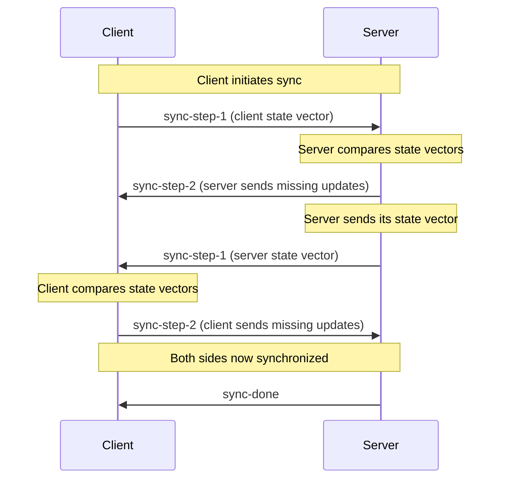

The Teleportal protocol is a binary protocol built on top of Y.js that handles document synchronization, awareness updates, file transfers, and custom RPC operations. This document explains the design decisions and rationale behind the protocol's architecture.

## Multiplexing Multiple Documents

One of the core design principles of the Teleportal protocol is **multiplexing**: the ability to sync multiple documents over a single connection. This is why every message is tagged with a `documentId`.

**Why multiplexing?** In real-world applications, clients often need to work with multiple documents simultaneously. Without multiplexing, you'd need a separate connection for each document, which would:
- Consume more network resources
- Increase connection overhead
- Make connection management more complex
- Limit scalability

By tagging each message with a `documentId`, the protocol allows a single WebSocket or HTTP connection to handle synchronization for many documents at once. The server and client can route messages to the correct document handler based on this identifier.

## Encryption Semantics

Encrypted messages are handled with different semantics than unencrypted messages, which is why messages include an **encryption flag** in their header.

**Why different semantics?** When a message is encrypted:
- The payload structure changes (it contains encrypted data rather than raw Y.js updates)
- The server's processing differs (it must decrypt before applying updates)
- Storage requirements may differ (encrypted documents may need different persistence strategies)

By marking messages as encrypted or not, the protocol ensures that:
- The server knows how to process each message correctly
- Clients can handle encrypted and unencrypted documents in the same connection
- The protocol can evolve encryption features independently

> **Note**: Encryption is currently in alpha and the API is subject to change.

## Document Synchronization Flow

The synchronization process uses a two-step handshake to efficiently determine what updates need to be exchanged. This design minimizes the amount of data transferred during initial sync.

**Why a two-step process?** When a client connects, both the client and server may have updates the other doesn't have. The protocol uses state vectors (compact representations of document state) to determine what's missing:

**The flow explained:**
1. **Client → Server (sync-step-1)**: Client sends its state vector, telling the server "this is what I have"
2. **Server → Client (sync-step-2)**: Server compares state vectors and sends only the updates the client is missing
3. **Server → Client (sync-step-1)**: Server sends its state vector, telling the client "this is what I have"
4. **Client → Server (sync-step-2)**: Client compares state vectors and sends only the updates the server is missing
5. **Server → Client (sync-done)**: Server confirms synchronization is complete

This bidirectional exchange ensures both sides converge to the same state with minimal data transfer, only sending what's actually needed.

## Connection Health: Ping/Pong

The protocol includes **ping/pong message types** to check if the connection is still active.

**Why ping/pong?** Network connections can fail silently. A client might think it's connected, but the connection could be dead. Without a keep-alive mechanism:
- Dead connections would go undetected
- Clients wouldn't know when to reconnect
- Resources would be wasted maintaining broken connections

Ping/pong messages allow both client and server to:
- Detect dead connections proactively
- Trigger reconnection logic when needed
- Maintain connection health metrics

The server or client can send a ping, and the recipient must respond with a pong. If no pong is received within a timeout period, the connection is considered dead and should be closed.

## Message Reliability: ACK Messages

**ACK (acknowledgment) messages** allow the client to know whether the server actually received and processed the message it was sent.

**Why ACKs?** In distributed systems, message delivery isn't guaranteed. A message could be:
- Lost in transit
- Received but not processed due to an error
- Processed but the response lost

Without ACKs, clients have no way to know if their messages were successfully handled. ACK messages provide:
- **Reliability**: Clients can retry if no ACK is received
- **Confirmation**: Clients know their updates were applied
- **Error detection**: Servers can send negative ACKs for failed operations

This is especially important for critical operations like document updates, where you need to ensure changes are persisted.

## Protocol Extensibility: RPC Messages

**RPC (Remote Procedure Call) messages** allow you to extend the protocol to add your own logic for sending and receiving data over the multiplexed connection.

**Why RPC?** While document synchronization is the core use case, real applications need more:
- File uploads and downloads
- Metadata operations (like milestones)
- Custom business logic
- Integration with external services

Rather than creating separate protocols or connections for these features, RPC messages let you:
- Reuse the same connection infrastructure
- Leverage existing authentication and multiplexing
- Add custom functionality without protocol changes

**Built-in RPC methods** demonstrate this pattern:
- **Milestones**: `milestoneList`, `milestoneCreate`, `milestoneGet`, etc.
- **Files**: `fileUpload`, `fileDownload`, etc.

These are all built on the RPC concept, showing how the protocol can be extended for domain-specific needs.

> **Note**: The RPC API is still in development, and more work will be done on improving the ergonomics of the API for custom RPC handlers.

## Binary Encoding for Efficiency

Messages are **encodable and decodable from binary** for efficient transmission over the network.

**Why binary?** Text-based protocols (like JSON) are human-readable but inefficient:
- Larger payload sizes (text encoding overhead)
- Slower parsing (string parsing is CPU-intensive)
- More bandwidth usage (especially for large Y.js updates)

Binary encoding provides:
- **Size efficiency**: Compact representation of data
- **Speed**: Fast encoding/decoding operations
- **Bandwidth savings**: Critical for real-time synchronization where every byte counts

The protocol uses a structured binary format with:
- **Header**: Message type, document ID, encryption flag, and context
- **Payload**: Type-specific binary data (Y.js updates, awareness states, RPC data, etc.)

This binary format is optimized for the specific needs of document synchronization, where you're frequently sending Y.js updates that are already in binary format.

## Design Philosophy

The Teleportal protocol is designed around a few core principles:

1. **Efficiency**: Minimize bandwidth and processing overhead
2. **Reliability**: Ensure message delivery and connection health
3. **Extensibility**: Allow custom functionality without protocol changes
4. **Simplicity**: Keep the core protocol simple while supporting complex use cases

These principles guide every design decision, from the binary encoding format to the RPC extensibility mechanism.

## Next Steps

- [Server](/docs/core-concepts/server/) - Learn how the server processes protocol messages
- [Transport](/docs/core-concepts/transport/) - Understand how messages are transmitted
- [Provider](/docs/core-concepts/provider/) - See how clients use the protocol
