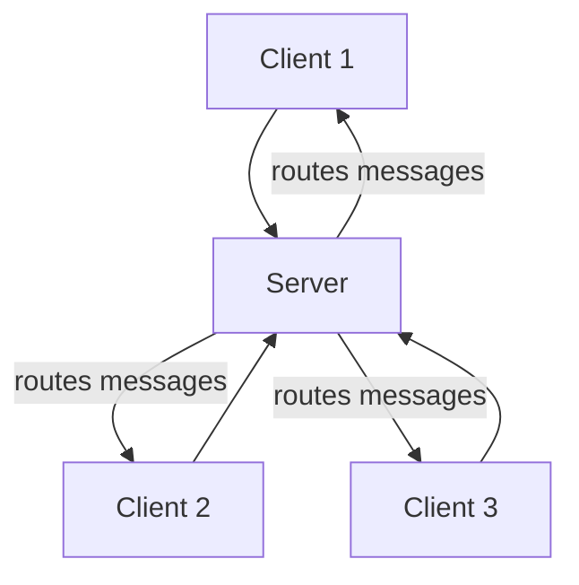
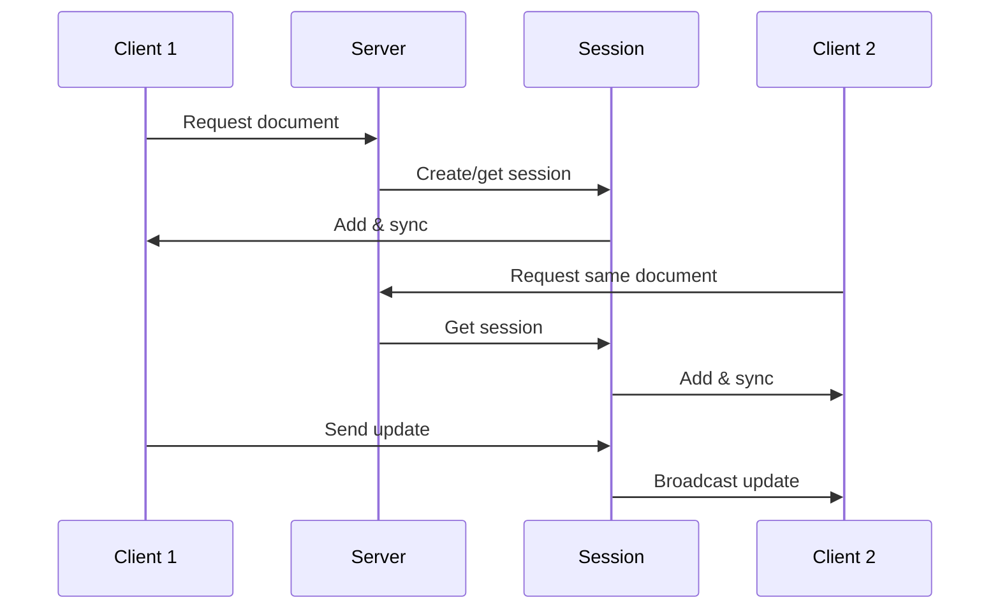
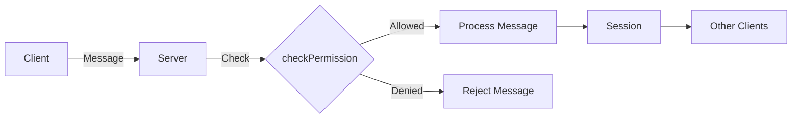
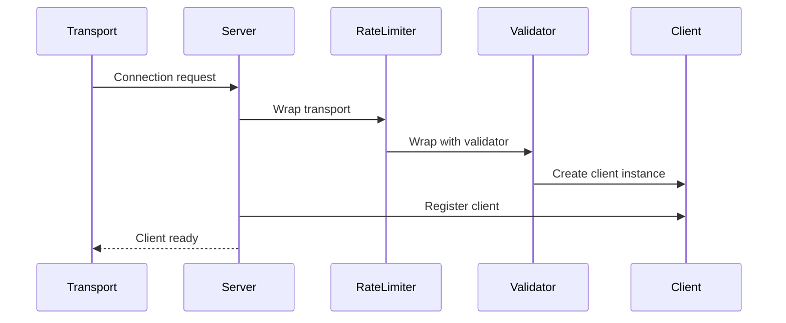
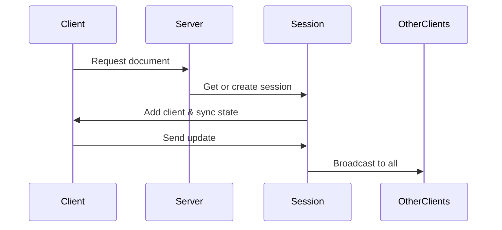
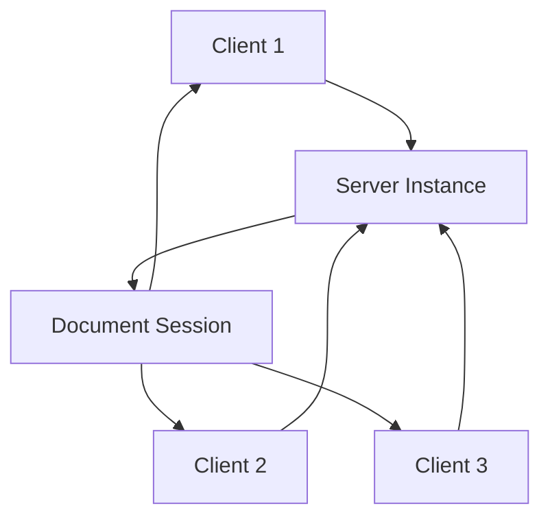
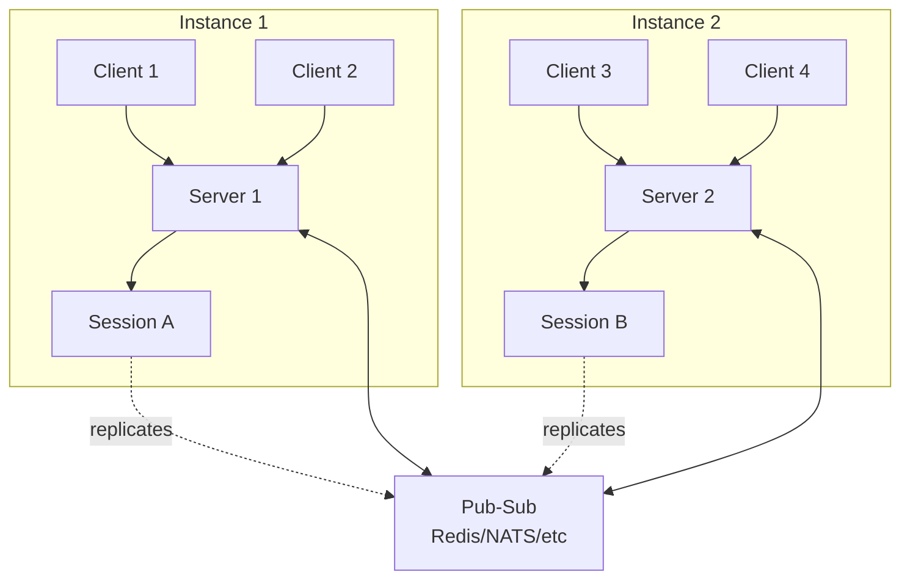
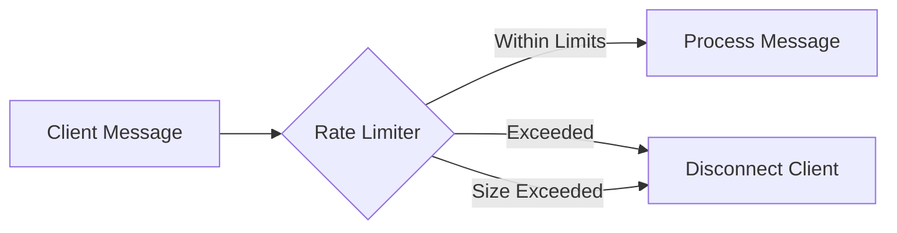
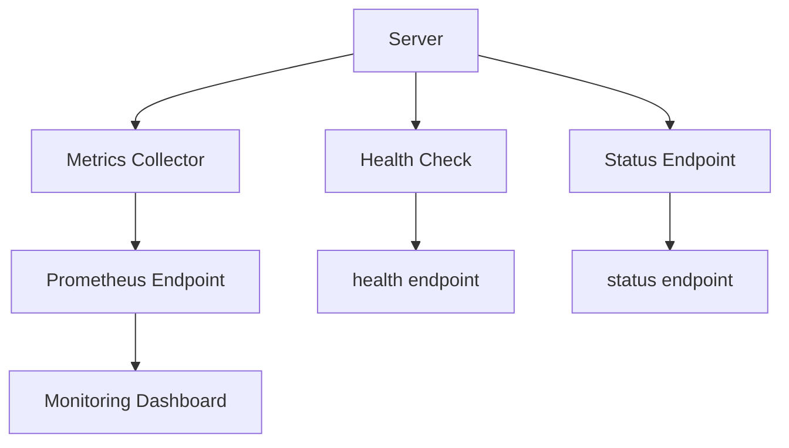
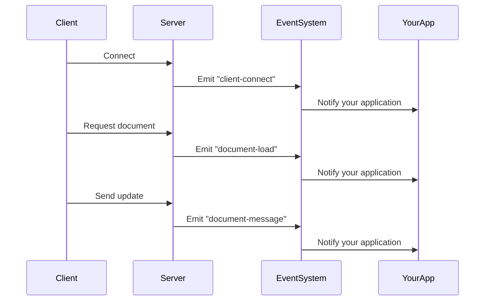

The Teleportal server is the central orchestrator that enables real-time collaboration on Y.js documents. Rather than just managing connections, it solves the fundamental challenge of **coordinating multiple clients** who need to see each other's changes while maintaining **security**, **performance**, and **reliability**.

## Why the Server Exists

At its core, the server solves a coordination problem: when multiple clients are editing the same document, they need a trusted intermediary to:

- **Route messages** between clients who are interested in the same document
- **Enforce permissions** to ensure only authorized users can access or modify documents
- **Coordinate state** across multiple server instances for horizontal scaling
- **Protect against abuse** through rate limiting and validation
- **Provide visibility** into system health and operations



## Connecting Clients to Document Sessions

The server's primary role is connecting clients to **document-based sessions**. Each session represents an active collaborative document that multiple clients are working on.

### Why Sessions Exist

Sessions exist because **clients need to know about each other's messages**. When Client A makes a change, Client B and Client C need to receive that update. The session acts as a coordination point:

- **Groups interested clients**: All clients working on the same document are part of the same session
- **Broadcasts messages**: When one client sends an update, the session ensures all other clients in that session receive it
- **Manages document state**: The session maintains the authoritative document state and coordinates synchronization



### Session Lifecycle

The server manages sessions with a clear lifecycle that balances **resource efficiency** with **responsiveness**:

1. **Creation**: When the first client requests a document, the server creates a session and loads the document from storage
2. **Active**: The session coordinates messages between all connected clients
3. **Cleanup**: When all clients disconnect, the session waits 60 seconds before cleanup (to handle quick reconnections)
4. **Disposal**: The session is removed from memory, but the document persists in storage

This lifecycle ensures that:
- **Memory is conserved**: Sessions only exist when needed
- **Reconnections are fast**: The 60-second grace period allows clients to reconnect without reloading
- **Documents persist**: Even when no session exists, documents remain in storage

## Permission & Access Control

The server **gates permissions and access control** in a flexible way, allowing you to either use your own implementation or leverage Teleportal's built-in capabilities.

### Why Permissions Matter

Without permission checks, any client could:
- Access any document
- Modify documents they shouldn't have access to
- Delete documents or files
- View sensitive information

The server provides a flexible `checkPermission` hook that runs **before every message is processed**, allowing you to implement your own authorization logic.



### Flexible Permission Model

You can implement permissions based on:
- **User identity**: Check if the user has access to the document
- **Document ownership**: Verify ownership or sharing permissions
- **Role-based access**: Implement role-based permissions (viewer, editor, admin)
- **Custom logic**: Any business logic you need

```typescript
const server = new Server({
  getStorage: async (ctx) => {
    // ... storage setup
  },
  checkPermission: async ({ context, documentId, fileId, message, type }) => {
    const userId = context.userId;
    
    // Your custom permission logic
    if (documentId) {
      return await hasDocumentAccess(userId, documentId, type);
    } else if (fileId) {
      return await hasFileAccess(userId, fileId, type);
    }
    
    return false;
  },
});
```

## Client Lifecycle & Synchronization

Understanding how clients are created, added to sessions, and synchronize with other clients is crucial for building reliable applications.

### Client Creation

When a client connects (via WebSocket, HTTP, or any transport), the server:

1. **Creates a client instance** with a unique ID
2. **Applies rate limiting** (if configured) to protect against abuse
3. **Sets up message validation** to enforce permissions
4. **Registers the client** for lifecycle tracking



### Adding Clients to Sessions

Once a client is created, it needs to join a session to participate in document collaboration:

1. **Client requests document**: The client sends a message indicating interest in a document
2. **Server gets or creates session**: The server either retrieves an existing session or creates a new one
3. **Session adds client**: The client is added to the session's client list
4. **Initial synchronization**: The client receives the current document state
5. **Message routing**: The client can now send and receive messages through the session



### Why This Lifecycle Matters

This lifecycle ensures:
- **Consistent state**: All clients start with the same document state
- **Efficient synchronization**: Only necessary data is transferred
- **Automatic cleanup**: When clients disconnect, they're automatically removed from sessions
- **Race condition prevention**: The server prevents multiple sessions from being created for the same document

## Deployment Modes

The server can operate in two distinct modes, depending on your scaling needs.

### Single Instance Mode

In single instance mode, the server runs without a pub-sub implementation. This is ideal for:
- **Development and testing**: Simple setup with no external dependencies
- **Small deployments**: When a single server instance can handle all traffic
- **Low-latency requirements**: Direct message routing without pub-sub overhead



### Multi-Instance with Pub-Sub

For horizontal scaling, the server can use a pub-sub implementation (like Redis) to coordinate between multiple instances. This enables:
- **Horizontal scaling**: Add more server instances as traffic grows
- **High availability**: If one instance fails, others continue serving clients
- **Geographic distribution**: Deploy instances in different regions



When a client on Instance 1 sends a message, it's:
1. Processed by the local session
2. Broadcast to other clients on Instance 1
3. Published to pub-sub
4. Received by Instance 2
5. Broadcast to clients on Instance 2

This ensures all clients see updates regardless of which instance they're connected to.

## Rate Limiting & Abuse Prevention

The server can **enforce rate limiting in a flexible way** and **kick clients for abuse**, protecting your system from:
- **Message flooding**: Clients sending too many messages too quickly
- **Resource exhaustion**: Attempts to consume server resources
- **Denial of service**: Malicious clients trying to disrupt service

### Why Rate Limiting Matters

Without rate limiting, a single malicious client could:
- Overwhelm the server with messages
- Cause other clients to experience delays
- Consume excessive storage or bandwidth
- Degrade the experience for legitimate users

### Flexible Rate Limiting

The server supports multiple rate limiting strategies:

- **Per-user**: Track limits across all documents for a user
- **Per-document**: Track limits across all users for a document
- **Per user-document pair**: Track limits for specific user-document combinations
- **Message size limits**: Prevent clients from sending oversized messages



When rate limits are exceeded, the server automatically disconnects the client, protecting the system from abuse.

```typescript
const server = new Server({
  getStorage: async (ctx) => {
    // ... storage setup
  },
  rateLimitConfig: {
    rules: [
      {
        id: "per-user",
        maxMessages: 100,
        windowMs: 1000,
        trackBy: "user",
      },
      {
        id: "per-document",
        maxMessages: 500,
        windowMs: 10000,
        trackBy: "document",
      },
    ],
    maxMessageSize: 10 * 1024 * 1024, // 10MB
    onRateLimitExceeded: (details) => {
      // Log or alert on abuse
      console.warn("Rate limit exceeded", details);
    },
  },
});
```

## Observability: Metrics, Health, & Logging

The server provides comprehensive observability to help you understand what's happening in your system.

### Why Observability Matters

Without visibility into your server, you can't:
- **Detect problems**: Know when something goes wrong
- **Understand usage**: See how clients are using your system
- **Plan capacity**: Make informed decisions about scaling
- **Debug issues**: Troubleshoot problems when they occur

### Metrics & Monitoring

The server automatically tracks Prometheus-compatible metrics:

- **Active sessions**: How many documents are currently active
- **Active clients**: How many clients are connected
- **Messages processed**: Total messages and breakdown by type
- **Message duration**: How long messages take to process
- **Rate limit events**: When and why rate limits are triggered



### Health Checks

The server provides health check endpoints that return:
- **Overall status**: `healthy` or `unhealthy`
- **Individual checks**: Status of storage, pub-sub, and other components
- **Uptime**: How long the server has been running

This enables:
- **Load balancer health checks**: Automatically route traffic away from unhealthy instances
- **Monitoring alerts**: Get notified when the server becomes unhealthy
- **Automated recovery**: Trigger recovery actions when health checks fail

### Logging with LogTape

The server uses [**LogTape**](https://logtape.org/) for structured logging, providing:
- **Structured logs**: JSON-formatted logs with consistent fields
- **Contextual information**: Each log includes relevant context (client ID, document ID, etc.)
- **Configurable sinks**: Send logs to console, files, or external services
- **Log levels**: Control verbosity with trace, debug, info, warn, error levels

You configure LogTape globally, and the server automatically uses it:

```typescript
import { configure } from "@logtape/logtape";

configure({
  sinks: [
    // Console for development
    new ConsoleSink(),
    // Or your production logging service
  ],
});
```

The server logs important events like:
- Client connections and disconnections
- Session creation and cleanup
- Document loads and unloads
- Permission denials
- Rate limit violations
- Errors and warnings

## Event System

The server **emits events for important lifecycle events** to keep your system in the loop on what it's doing.

### Why Events Matter

Events enable you to:
- **Integrate with external systems**: Send webhooks, update databases, trigger workflows
- **Build custom monitoring**: Track events in your own monitoring system
- **Implement business logic**: React to server events in your application
- **Debug and audit**: Understand what happened and when

### Available Events

The server emits events for:

**Document Lifecycle**:
- `document-load`: When a document session is created and loaded
- `document-unload`: When a document session is disposed
- `document-delete`: When a document is deleted from storage

**Client Lifecycle**:
- `client-connect`: When a client connects to the server
- `client-disconnect`: When a client disconnects (with reason)
- `client-message`: Every message sent or received (for metrics/webhooks)

**Session Events**:
- `session-open`: When a new session is opened
- `client-join`: When a client joins a session
- `client-leave`: When a client leaves a session
- `document-message`: When a message is applied to a document

**Operational Events**:
- `rate-limit-exceeded`: When a client exceeds rate limits
- `document-size-warning`: When a document exceeds size warning threshold
- `milestone-created`: When a milestone is created
- `before-server-shutdown`: Before server shutdown starts
- `after-server-shutdown`: After server shutdown completes



### Using Events

You can listen to events to integrate with your systems:

```typescript
// Track client connections in your database
server.on("client-connect", async (data) => {
  await db.clients.create({
    clientId: data.clientId,
    connectedAt: new Date(),
  });
});

// Send webhooks when documents are loaded
server.on("document-load", async (data) => {
  await sendWebhook({
    event: "document.opened",
    documentId: data.documentId,
    userId: data.context.userId,
  });
});

// Alert on rate limit violations
server.on("rate-limit-exceeded", async (data) => {
  await alertingService.send({
    severity: "warning",
    message: `Rate limit exceeded for user ${data.userId}`,
  });
});
```

## Summary

The Teleportal server exists to solve the coordination problem of real-time collaboration. It:

- **Connects clients to document sessions** so they can see each other's changes
- **Enforces permissions** flexibly to protect your documents
- **Manages client lifecycle** from connection to synchronization
- **Scales horizontally** with pub-sub coordination
- **Protects against abuse** with flexible rate limiting
- **Provides observability** through metrics, health checks, and logging
- **Emits events** to keep your system informed

Understanding these "whys" helps you build reliable, secure, and scalable collaborative applications.

## Next Steps

- [Transport](/docs/core-concepts/transport/) - Learn how messages are transmitted between clients and server
- [Provider](/docs/core-concepts/provider/) - See how clients connect to the server
- [Storage](/docs/storage/) - Understand how documents are persisted
- [Guides](/docs/guides/) - Step-by-step implementation guides
