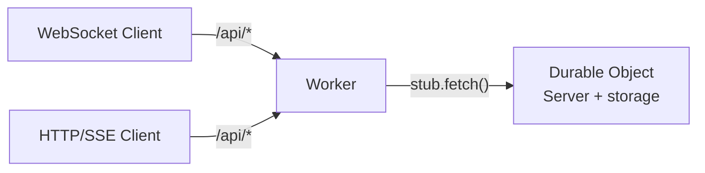

import { Aside } from "@astrojs/starlight/components";

`teleportal/cloudflare` runs a full Teleportal sync server on Cloudflare Workers, backed entirely by Durable Object storage -- no KV namespace, R2 bucket, or external database required.

## What it demonstrates

- Hosting the Teleportal `Server` inside a Durable Object, with WebSocket and HTTP/SSE clients sharing one instance
- Every storage interface (documents, files, milestones, rate limits, key registry) implemented directly on Durable Object storage
- Handling Durable Object hibernation without dropping client state
- Deploying with `wrangler`, entirely offline-testable via `wrangler dev`

## Architecture

A Worker forwards all sync traffic -- WebSocket upgrades **and** HTTP/SSE requests -- to a single Durable Object instance, which hosts the Teleportal `Server`. Because every connection lands in the same instance, WebSocket clients and SSE/HTTP clients share one set of sessions and the in-memory PubSub, with no cross-instance coordination needed.



## Storage

Every Teleportal storage interface has a direct implementation on Durable Object storage (`ctx.storage`) -- there's no adapter layer in between. Values ride structured clone, so updates, sidecars, chunks, and wrapped keys stay binary.

| Class                                 | Interface                |
| ------------------------------------- | ------------------------ |
| `DurableObjectDocumentStorage`        | `DocumentStorage`        |
| `DurableObjectFileStorage`            | `FileStorage`            |
| `DurableObjectTemporaryUploadStorage` | `TemporaryUploadStorage` |
| `DurableObjectMilestoneStorage`       | `MilestoneStorage`       |
| `DurableObjectRateLimitStorage`       | `RateLimitStorage`       |
| `DurableObjectKeyRegistryStorage`     | `KeyRegistryStorage`     |

A few implementation details worth knowing:

- The document pending log stores one update per key (zero-padded sequence numbers), so appends are O(1) writes rather than a read-append-rewrite of a single array.
- `transaction()` is backed by `ctx.storage.transaction()` -- a Durable Object instance is the single writer for its own storage, so no TTL or advisory locks are needed.
- Rate-limit TTLs are stamped expiry timestamps, since Durable Object storage has no native TTL; expired state reads as absent and is deleted lazily.
- Use SQLite-backed Durable Objects (`new_sqlite_classes` in the migration config) -- available on the free plan, with a 2 MiB per-value limit. A document's compacted state and a milestone snapshot are each a single value, so this bounds document size. File chunks are 1 MiB and always fit.

## Durable Object Wiring

```typescript
import crossws from "crossws/adapters/cloudflare";
import { Server } from "teleportal/server";
import { getHTTPHandlers } from "teleportal/http";
import {
  DurableObjectDocumentStorage,
  getDurableObjectHandlers,
  getDurableObjectWebsocketHooks,
} from "teleportal/cloudflare";

export class TeleportalDurableObject {
  ctx;
  env;
  #handlers;

  constructor(state: DurableObjectState, env: Env) {
    this.ctx = state; // crossws expects the state on `.ctx`
    this.env = env;

    const server = new Server({
      storage: async () =>
        new DurableObjectDocumentStorage(state.storage, { keyPrefix: "document" }),
    });

    const getContext = () => ({ userId: "someone", room: "docs" });

    this.#handlers = getDurableObjectHandlers({
      ws: crossws({
        hooks: getDurableObjectWebsocketHooks({
          server,
          onUpgrade: async () => ({ context: getContext() }),
        }),
      }),
      http: getHTTPHandlers({ server, getContext }),
    });
  }

  fetch(request: Request) {
    return this.#handlers.fetch(this, request);
  }
  webSocketMessage(ws: WebSocket, message: ArrayBuffer | string) {
    return this.#handlers.webSocketMessage(this, ws, message);
  }
  webSocketClose(ws: WebSocket, code: number, reason: string, wasClean: boolean) {
    return this.#handlers.webSocketClose(this, ws, code, reason, wasClean);
  }
  webSocketPublish(topic: string, data: unknown, opts?: unknown) {
    return this.#handlers.webSocketPublish(this, topic, data, opts);
  }
}
```

The Worker resolves the instance and forwards everything -- WebSocket upgrades pass through `stub.fetch` unchanged:

```typescript
export default {
  async fetch(request: Request, env: Env) {
    const stub = env.TELEPORTAL_DO.get(env.TELEPORTAL_DO.idFromName("teleportal"));
    return stub.fetch(request);
  },
};
```

<Aside type="tip">
  Route WebSocket upgrades and HTTP/SSE requests under the same path prefix (e.g. `/api/*`) so both
  transports reach the same Durable Object instance. A WebSocket upgrade is a plain `GET /`, so if
  you also configure Workers `[assets]`, keep the API prefix distinct from your static asset paths
  or the upgrade will never reach the Worker.
</Aside>

## WebSockets and Hibernation

`getDurableObjectWebsocketHooks({ server, onUpgrade })` wraps `getWebsocketHandlers` from `teleportal/websocket-server` for crossws's Cloudflare adapter (`crossws/adapters/cloudflare`), which has two quirks this package accounts for:

- **Dropped upgrade context**: the durable upgrade path drops the context returned by the upgrade hook. The wrapper stashes it per-request and re-applies it to `peer.context` before `open` runs.
- **Hibernation wake-up**: the adapter uses the WebSocket Hibernation API. When an instance is evicted and later woken by a message, the peer's in-memory state is gone. The websocket-server hooks detect this and close the socket so the client reconnects and resyncs automatically. Open SSE connections prevent hibernation entirely.

This package never imports `crossws/adapters/cloudflare` itself, since that module only resolves inside workerd -- instantiate it in your Worker code and pass it to `getDurableObjectHandlers`.

## Local Development and Testing

`wrangler dev` runs on `workerd` (the same runtime Cloudflare uses in production) fully offline -- no Cloudflare account needed, and Durable Object storage is emulated locally:

```bash
cd examples/cloudflare
bun run dev
```

Open `http://localhost:8787` in two tabs and type -- edits sync between tabs through the Durable Object.

Because `workerd` runs locally, you can write real integration tests that spawn `wrangler dev` as a subprocess and assert against actual sync behavior (WebSocket round-trips, SSE wire format, persistence across reconnects) instead of mocking the runtime. See [`examples/cloudflare/src/integration.test.ts`](https://github.com/nperez0111/teleportal/blob/main/examples/cloudflare/src/integration.test.ts) for the pattern.

## Scaling Beyond One Instance

`idFromName("teleportal")` pins the whole app to one Durable Object. To shard, derive the instance name from the room (e.g. `idFromName(room)`) in both the Worker and any place that mints client URLs -- every client of a room must land on the same instance.

## Scope and Caveats

- **No built-in auth in the example**: the example wires a static `{ userId, room }` context. For real deployments, use `TokenManager` (`teleportal/token`) with `tokenAuthenticatedHTTPHandler` or a token check in `onUpgrade` -- `jose` runs fine on workerd. See [Authentication](/docs/guides/authentication/).
- **One Durable Object instance per app by default** -- see Scaling above to shard by room.
- **2 MiB value size limit** on SQLite-backed Durable Object storage. A document's compacted state and a milestone snapshot are each one value; file chunks (1 MiB) always fit.
- **No `crossws/adapters/cloudflare` import inside `teleportal/cloudflare`** -- that module only resolves inside workerd, so the library exposes hooks with type-only crossws imports and expects the consumer to instantiate the adapter.

## Full Example

See [`examples/cloudflare`](https://github.com/nperez0111/teleportal/tree/main/examples/cloudflare) for a complete, deployable example: wrangler config, static assets, a bundled ProseMirror browser client, and all storages wired into RPC handlers.

## Next Steps

- [Authentication](/docs/guides/authentication/) - Add real token-based auth in place of the static example context
- [Custom Storage](/docs/guides/custom-storage/) - Implement additional storage backends
- [Scaling](/docs/advanced/scaling/) - Sharding and multi-instance strategies
