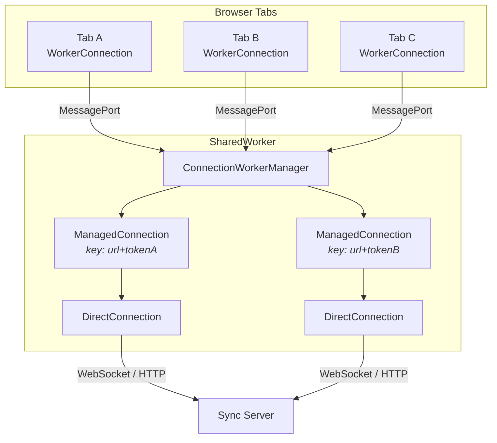

import { Aside } from "@astrojs/starlight/components";

When running in a browser that supports [`SharedWorker`](https://developer.mozilla.org/en-US/docs/Web/API/SharedWorker), Teleportal can offload the network connection to a shared worker. All open tabs then share a single underlying WebSocket (or HTTP) connection to the sync server, reducing resource usage and keeping state consistent across tabs.

This is opt-in: pass a `workerUrl` to `createConnection()` or use `WorkerProvider.create()`. When `SharedWorker` is unavailable (Node.js, older browsers, `file://` origins, restrictive CSP), the system transparently falls back to a direct in-thread connection.

## What it demonstrates

- Offloading the network connection to a SharedWorker
- Connection pooling across browser tabs
- Automatic fallback when SharedWorker is unavailable
- Grace period to survive page reloads without reconnection

## Quick Start

The simplest way to use SharedWorker support is through `WorkerProvider`:

```typescript
import { WorkerProvider } from "teleportal/providers/worker";
import { websocketTransport, httpTransport } from "teleportal/providers";

const provider = await WorkerProvider.create({
  // Point to your worker script (see "Worker Script" below)
  workerUrl: new URL("./worker.ts", import.meta.url),

  // Server URL
  url: "wss://example.com/sync",

  // Transports used as fallback if SharedWorker is unavailable
  transports: [websocketTransport(), httpTransport()],

  // Document to sync
  document: "my-document",
  encryptionKey: createEncryptionKey(),
});

await provider.synced;

// Use exactly like a regular Provider
provider.doc.getText("content").insert(0, "Hello from SharedWorker!");
```

## Worker Script

The worker script runs inside the SharedWorker and maps serializable transport descriptors to real transport instances. Teleportal ships a default entry point at `teleportal/providers/worker/connection-worker`, or you can write your own:

```typescript
// worker.ts
import { ConnectionWorkerManager } from "teleportal/providers/worker";
import { websocketTransport } from "teleportal/providers";
import { httpTransport } from "teleportal/providers";

const manager = new ConnectionWorkerManager((options) => {
  if (options.transports && options.transports.length > 0) {
    return options.transports.map((desc) => {
      switch (desc.type) {
        case "websocket":
          return websocketTransport(desc.options);
        case "http":
          return httpTransport(desc.options);
        default:
          throw new Error(`Unknown transport type: ${desc.type}`);
      }
    });
  }
  // Default transports when none are specified
  return [websocketTransport({ timeout: 5000 }), httpTransport()];
});

declare const self: { onconnect: ((event: MessageEvent) => void) | null };
self.onconnect = (event: MessageEvent) => {
  manager.addPort(event.ports[0]);
};
```

<Aside type="tip">
  The worker script must be bundled separately from your main application. Most bundlers (Vite,
  esbuild, webpack) handle `new URL("./worker.ts", import.meta.url)` as a separate entry point
  automatically.
</Aside>

## Using `createConnection` Directly

For more control, use `createConnection` to get a `Connection` instance and pair it with a `Provider` yourself:

```typescript
import { createConnection } from "teleportal/providers/worker";
import { Provider } from "teleportal/providers";
import { websocketTransport, httpTransport } from "teleportal/providers";

const connection = createConnection({
  workerUrl: new URL("./worker.ts", import.meta.url),
  url: "wss://example.com/sync",
  token: { token: jwt },
  transports: [websocketTransport(), httpTransport()],

  // Optional: descriptors forwarded to the worker
  workerTransports: [
    { type: "websocket", options: { timeout: 5000 } },
    { type: "http", options: {} },
  ],

  // Called if the SharedWorker crashes or heartbeat times out
  onWorkerDeath: () => {
    console.warn("SharedWorker died — consider reloading");
  },
});

const provider = new Provider({
  connection,
  document: "my-document",
  encryptionKey: createEncryptionKey(),
});

await provider.synced;
```

## How Connection Pooling Works

The `ConnectionWorkerManager` inside the worker pools connections using a **connection key** derived from the URL and authentication token:

```
key = url + "::" + token
```

- **Same user, same server**: all tabs share one WebSocket connection.
- **Different tokens** (different users or auth sessions): separate connections, keeping attribution isolated.
- **Page reload**: the grace period (default 5 seconds) keeps the connection alive so the reloaded tab reconnects instantly without a server handshake.

### Custom Pooling Key

Override the default key function to control which tabs share connections:

```typescript
const manager = new ConnectionWorkerManager(transportFactory, {
  getConnectionKey: (options) => {
    // Key on user ID so token refreshes don't create new connections
    const claims = decodeJwt(options.token);
    return `${options.url}::${claims.sub}`;
  },
  gracePeriodMs: 10_000, // Keep connection alive 10s after last tab leaves
});
```

## Architecture



Each `ManagedConnection` wraps a single `DirectConnection` and handles:

- **Event forwarding** to all attached ports
- **Online/offline reconciliation** (connection stays online if _any_ tab is online)
- **Grace period cleanup** when the last tab disconnects

## Heartbeat and Liveness

Each tab runs a heartbeat loop (default: 5-second interval, 2 max missed pings) to detect if the SharedWorker has crashed:

1. The main thread sends a `heartbeat` message every interval
2. The worker replies with `heartbeat-ack`
3. If more than `maxMisses` consecutive acks are missed, the worker is declared dead
4. The `onWorkerDeath` callback fires, allowing you to fall back or notify the user

<Aside type="note">
  Heartbeat detection is per-tab. If one tab's port breaks but the worker is alive, only that tab
  detects the failure. Other tabs continue normally.
</Aside>

## Online/Offline Handling

Each tab forwards browser `online`/`offline` events to the worker. The worker uses an **any-tab-online** policy:

- If **any** tab reports online, the connection stays up and reconnection is allowed
- Only when **all** tabs report offline does the connection go offline
- During the grace period (no tabs attached), the connection defaults to online

This prevents a single backgrounded tab from taking the shared connection offline.

## Fallback Behavior

`createConnection` handles fallback transparently:

1. If `workerUrl` is provided and `SharedWorker` is available, creates a `WorkerConnection`
2. If `SharedWorker` construction fails (CSP, `file://` origin, etc.), falls back to `DirectConnection`
3. If `workerUrl` is omitted, always creates a `DirectConnection`

The returned `Connection` implements the same interface in all cases. Your `Provider` code does not need to know whether it is backed by a SharedWorker or a direct connection.

## Configuration Reference

### `createConnection` Options

| Option                  | Type                    | Default    | Description                                                      |
| ----------------------- | ----------------------- | ---------- | ---------------------------------------------------------------- |
| `workerUrl`             | `string \| URL`         | —          | URL of the SharedWorker script. Omit to use a direct connection. |
| `url`                   | `string`                | (required) | Sync server URL.                                                 |
| `token`                 | `TokenOptions`          | —          | Authentication token.                                            |
| `transports`            | `ConnectionTransport[]` | (required) | Transport instances for the direct fallback path.                |
| `workerTransports`      | `TransportDescriptor[]` | —          | Serializable transport descriptors forwarded to the worker.      |
| `onWorkerDeath`         | `() => void`            | —          | Called if the SharedWorker crashes or heartbeat times out.       |
| `connect`               | `boolean`               | `true`     | Auto-connect on creation.                                        |
| `maxReconnectAttempts`  | `number`                | `10`       | Max reconnection attempts.                                       |
| `initialReconnectDelay` | `number`                | `100`      | Initial backoff delay (ms).                                      |
| `maxBackoffTime`        | `number`                | `30000`    | Maximum backoff delay (ms).                                      |

### `ConnectionWorkerManager` Options

| Option             | Type                  | Default     | Description                                                         |
| ------------------ | --------------------- | ----------- | ------------------------------------------------------------------- |
| `gracePeriodMs`    | `number`              | `5000`      | How long to keep a connection alive after the last tab disconnects. |
| `getConnectionKey` | `(options) => string` | URL + token | Custom function to determine which tabs share a connection.         |

## Next Steps

- [Fallback Connection](/docs/guides/fallback-connection/) - Automatic WebSocket-to-HTTP fallback
- [WebSocket Only](/docs/guides/websocket-only/) - Minimal WebSocket setup
- [Performance](/docs/advanced/performance/) - Performance optimization strategies
