This guide helps you make decisions about how to integrate Teleportal into your application.

## Storage

Teleportal supports any storage backend through the `DocumentStorage` interface. **Unstorage** (recommended) works with Redis, PostgreSQL, S3, and many other backends. For development, use **in-memory storage**. For special requirements, implement a custom `DocumentStorage` interface.

```typescript
// Unstorage (production)
import { createStorage } from "unstorage";
import { UnstorageDocumentStorage } from "teleportal/storage";
import redisDriver from "unstorage/drivers/redis";

const storage = createStorage({
  driver: redisDriver({ base: "teleportal:" }),
});

const server = new Server({
  storage: async (ctx) => {
    return new UnstorageDocumentStorage(storage, {
      keyPrefix: "doc",
      encrypted: ctx.encrypted,
    });
  },
});

// In-memory (development)
import { MemoryDocumentStorage } from "teleportal/storage";

const server = new Server({
  storage: async (ctx) => {
    return new MemoryDocumentStorage(ctx.encrypted);
  },
});
```

See [Custom Storage](/docs/advanced/custom-storage/) for custom implementations.

## Transport

**WebSocket** (default) provides bidirectional communication with low latency. Use **HTTP with Server-Sent Events** for corporate networks that block WebSockets. The client can automatically use a **fallback connection** that tries WebSocket first, then falls back to HTTP.

```typescript
// WebSocket
import { getWebsocketHandlers } from "teleportal/websocket-server";

const handlers = getWebsocketHandlers({
  server,
  onUpgrade: async (request) => {
    return { context: { userId: "user-123" } };
  },
});

// HTTP/SSE
import { getHTTPHandlers } from "teleportal/http";

const handlers = getHTTPHandlers({
  server,
  getContext: async (request) => {
    return { userId: "user-123" };
  },
});
```

## Encryption

**Content-level end-to-end encryption is the default.** The client encrypts document content into sidecars before it leaves the device; the server only ever sees the plaintext CRDT structure (needed for merge/sync) and the encrypted sidecars — never your content or keys. Every `Provider` requires an `encryptionKey` (a `CryptoKey`); to deliberately run a plaintext document, pass `encryptionKey: false`.

```typescript
import { Provider } from "teleportal/providers";
import {
  createEncryptionKey,
  exportEncryptionKey,
  keyToUrlFragment,
} from "teleportal/encryption-key";

// Encrypted by default
const provider = await Provider.create({
  url: "wss://example.com",
  document: "my-document",
  encryptionKey: createEncryptionKey(),
});

// Share the key with collaborators via the URL fragment (never sent to the server)
location.hash = keyToUrlFragment(await exportEncryptionKey(provider.encryptionKey));

// Opt a single document out into plaintext
const plaintextProvider = await Provider.create({
  url: "wss://example.com",
  document: "public-doc",
  encryptionKey: false,
});
```

The server enforces that all clients of one document agree on encryption mode (mixing plaintext and encrypted clients on the same document throws). Note that this is distinct from [Encryption at Rest](/docs/guides/encryption-at-rest/), which encrypts data in the storage backend server-side.

## Runtime

Teleportal works on any JavaScript runtime: **Bun** (recommended, fastest), Node.js, Deno, Cloudflare Workers, and edge runtimes (Vercel, Netlify).

## Authentication

**JWT tokens** (built-in) include IAM-like permissions. For existing auth systems, implement custom authentication in `onUpgrade`.

```typescript
// JWT (built-in)
import { createTokenManager } from "teleportal/token";

const tokenManager = createTokenManager({
  secret: "your-secret-key",
  expiresIn: 3600,
});

const token = await tokenManager.createToken("user-123", "org-456", [
  { pattern: "user-123/*", permissions: ["read", "write"] },
]);

// Custom auth
const handlers = getWebsocketHandlers({
  server,
  onUpgrade: async (request) => {
    const user = await verifySession(request);
    if (!user) throw new Response("Unauthorized", { status: 401 });
    return { context: { userId: user.id } };
  },
});
```

## Features

**Document synchronization** is always included. **File synchronization** and **milestone synchronization** are optional. You can also implement custom RPC handlers.

```typescript
// File sync (optional)
import { getFileRpcHandlers } from "teleportal/protocols/file";

const server = new Server({
  rpcHandlers: {
    ...getFileRpcHandlers(fileStorage),
  },
});

// Milestone sync (optional)
import { getMilestoneRpcHandlers } from "teleportal/protocols/milestone";

const server = new Server({
  rpcHandlers: {
    ...getMilestoneRpcHandlers(milestoneStorage),
  },
});
```

## Deployment

For **single-node** deployments, run one server instance with in-memory or local storage. For **multi-node** deployments, use shared storage with PubSub (Redis, NATS) for message coordination, or use an HTTP load balancer with sticky sessions.

```typescript
// Multi-node with PubSub
import { RedisPubSub } from "teleportal/transports/redis";

const server = new Server({
  storage: async (ctx) => {
    // Shared storage
  },
  pubSub: new RedisPubSub({
    path: "redis://localhost:6379",
  }),
  nodeId: process.env.NODE_ID,
});
```

See [Scaling](/docs/advanced/scaling/) for custom deployment strategies.

## Monitoring & Logging

Built-in **Prometheus metrics** and **health checks** are available. Integrate custom monitoring using server events. Teleportal uses `@logtape/logtape` for structured logging—configure adapters for your logging system.

```typescript
// Metrics & health
import { getMetricsHandler, getHealthHandler } from "teleportal/http";

app.get("/metrics", getMetricsHandler(server));
app.get("/health", getHealthHandler(server));

// Custom monitoring
server.on("client-connect", (data) => {
  // Send to your monitoring system
});
```

## Decision Tree

```mermaid
flowchart TD
    Start([Start]) --> Storage{Storage}
    Storage -->|Most cases| Unstorage[Unstorage]
    Storage -->|Dev / test| InMemory[In-Memory]

    Start --> Transport{Transport}
    Transport -->|Default| WS[WebSocket]
    Transport -->|Firewalls| HTTP[HTTP / SSE]

    Start --> Runtime{Runtime}
    Runtime -->|Recommended| Bun[Bun]
    Runtime -->|Also supported| Node[Node.js]
    Runtime -->|Also supported| Deno[Deno]
    Runtime -->|Also supported| Edge[Edge Runtimes]

    Start --> Auth{Auth}
    Auth -->|Built-in| JWT[JWT]
    Auth -->|Existing system| Custom[Custom onUpgrade]

    Start --> Encryption{Encryption}
    Encryption -->|Default| E2EE[Content E2EE]
    Encryption -->|Per-doc opt-out| Plaintext["Plaintext (encryptionKey: false)"]

    Start --> Features{Features}
    Features -->|Always| DocSync[Document Sync]
    Features -->|Optional| FileSync[File Sync]
    Features -->|Optional| Milestones[Milestones]

    Start --> Deployment{Deployment}
    Deployment -->|One instance| Single[Single-node]
    Deployment -->|Scaling| Multi[Multi-node + PubSub]

    Start --> Monitoring{Monitoring}
    Monitoring -->|Built-in| Prometheus[Prometheus]
    Monitoring -->|Custom| CustomMon[Server Events]
```



## Next Steps

- [Core Concepts](/docs/core-concepts/) - Understand the architecture
- [Guides](/docs/guides/) - Step-by-step implementation guides
- [Advanced Topics](/docs/advanced/) - Custom implementations and optimizations
