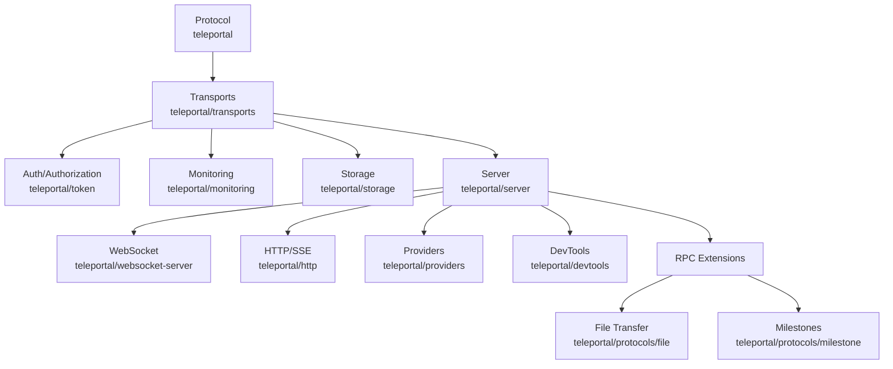

# Teleportal

A real-time collaborative editing framework built on Y.js

<div class="pt-12">
  <span @click="$slidev.nav.next" class="px-2 py-1 rounded cursor-pointer" hover="bg-white bg-opacity-10">
    Press Space for next page <carbon:arrow-right class="inline"/>
  </span>
</div>

<div class="abs-br m-6 flex gap-2">
  <button @click="$slidev.nav.openInEditor()" title="Open in Editor" class="text-xl slidev-icon-btn opacity-50 !border-none !hover:text-white">
    <carbon:edit />
  </button>
  <a href="https://github.com/nperez0111/teleportal" target="_blank" alt="GitHub" title="Open in GitHub" class="text-xl slidev-icon-btn opacity-50 !border-none !hover:text-white">
    <carbon:logo-github />
  </a>
</div>

---
transition: fade-out
---

# What is Teleportal?

<div class="text-left">

**A real-time collaborative editing framework built on Y.js**

Enables collaborative editing like Google Docs, Notion, and Figma by synchronizing Y.js documents between clients.

</div>

<div v-click class="mt-8">

**Key Point:** Teleportal is a **framework**, not a monolithic server.

It's a library of components you can use to build collaborative editing into your application.

</div>

---
transition: slide-up
---

# Framework Architecture

<div v-click>



</div>

<div v-click class="mt-4 text-sm">

**Components work together:** Protocol messages flow through transports with middleware (encryption, rate limiting, logging), authentication validates every message, storage persists documents, and the server coordinates client connections.

</div>

---
transition: slide-up
---

# Key Design Choices

<div class="grid grid-cols-2 gap-6 text-sm">

<div v-click>

## Storage Agnostic

Use any backend:
- KV stores
- Relational databases
- S3, Cloudflare R2
- Your own implementation

</div>

<div v-click>

## Runtime Agnostic

Built on web standards:
- Node.js, Bun, Deno
- Cloudflare Workers
- Vercel Edge Functions
- Minimal dependencies

</div>

<div v-click>

## Transport Agnostic

Use any transport:
- WebSocket
- HTTP
- Server-Sent Events (SSE)
- Custom transports

</div>

<div v-click>

## Framework Agnostic

No frontend framework:
- Just JavaScript
- Works with React, Vue, Svelte, etc.
- Or vanilla JS

</div>

</div>

<div v-click class="mt-6">

**Plus:** End-to-end encryption support built into the protocol

</div>

---
transition: slide-up
---

# Cool Feature #1: Transport Fallback

<div v-click>

**Problem:** WebSockets might be blocked (corporate firewalls, etc.)

</div>

<div v-click class="mt-4">

**Solution:** Automatic fallback from WebSocket → HTTP + SSE

</div>

<div v-click class="mt-6">

```typescript
const provider = await Provider.create({
  url: "wss://example.com",
  // Automatically falls back to HTTP/SSE if WebSocket fails
})
```

</div>

<div v-click class="mt-6 text-sm">

**Why this matters:** With Teleportal's transport-agnostic design, you can implement this yourself. Many monolithic sync servers can't do this, or you'd have to wait for them to implement it.

</div>

---
transition: slide-up
---

# Cool Feature #2: RPC Extensions

<div v-click>

**Built-in RPC system** enables protocol extensions beyond basic document sync:

</div>

<div class="grid grid-cols-2 gap-6 mt-6">

<div v-click>

## File Transfer

`teleportal/protocols/file`

- Chunked file transfer
- Merkle tree verification
- Content-addressable storage
- Up to 1GB files

</div>

<div v-click>

## Milestones

`teleportal/protocols/milestone`

- Capture document snapshots
- See document state at any point in time
- Named milestones with metadata
- Lazy loading

</div>

</div>

<div v-click class="mt-6 text-sm">

**Plus:** With Y.js 14, attribution tracking to see who made what changes

</div>

---
transition: slide-up
---

# Why This Matters

<div class="grid grid-cols-2 gap-6">

<div v-click>

## Flexibility

- Choose your own storage, transport, runtime
- Compose only what you need
- Extend with custom components

</div>

<div v-click>

## Control

- Not locked into a monolithic server
- Implement features yourself
- Full control over your stack

</div>

</div>

<div v-click class="mt-8">

**Example:** Transport fallback, custom middleware, your own storage backend - all possible because Teleportal is a framework, not a black box.

</div>

---
layout: center
class: text-center
---

# Closing Thoughts

<div class="mt-8 text-xl">

Teleportal is a **work in progress**, but I'm very excited to see where it goes.

</div>

<div class="mt-8 text-2xl">

**Hoping it becomes the**  
**_de facto_ Y.js sync server**  
**for web applications**

</div>

<div class="mt-8 text-lg">

📚 [Documentation](https://teleportal.dev)  
💻 [GitHub](https://github.com/nperez0111/teleportal)  
📦 [npm](https://npmjs.com/package/teleportal)

</div>

---
layout: center
class: text-center
---

# Questions?

<div class="mt-8 text-xl">

Thank you! 🚀

</div>

<div class="mt-8">

<carbon:logo-github class="inline text-4xl" />  
[github.com/nperez0111/teleportal](https://github.com/nperez0111/teleportal)

</div>
